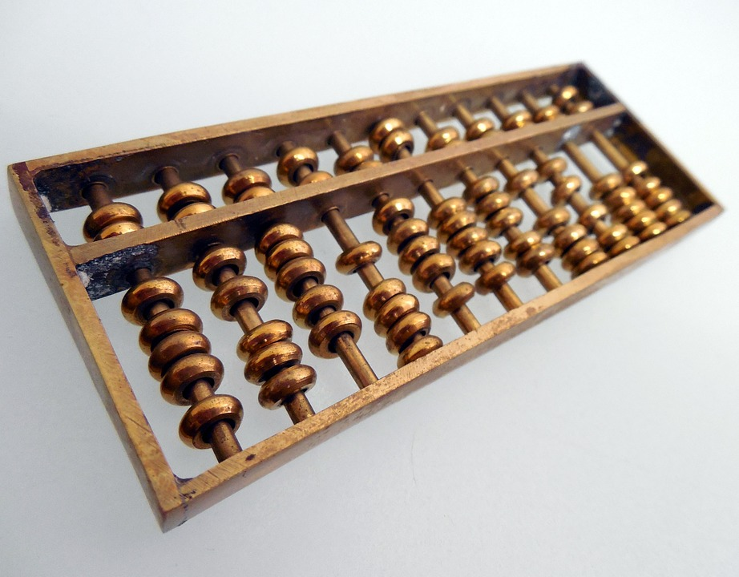
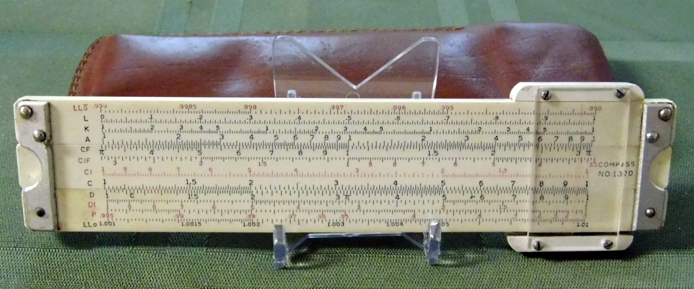
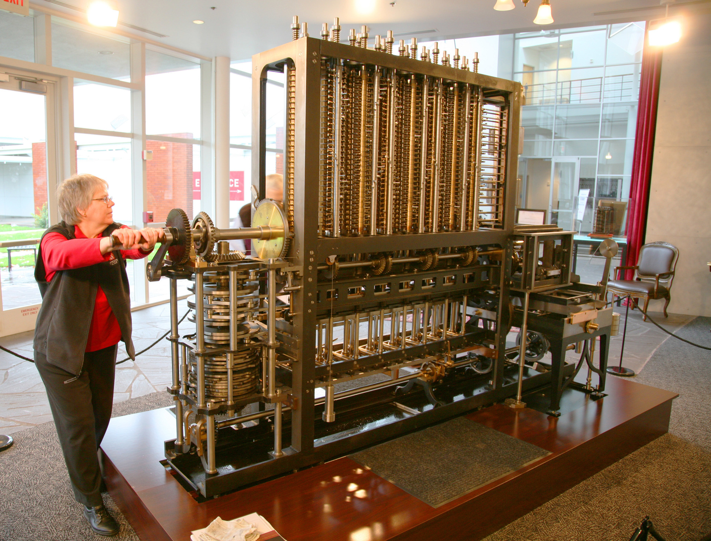
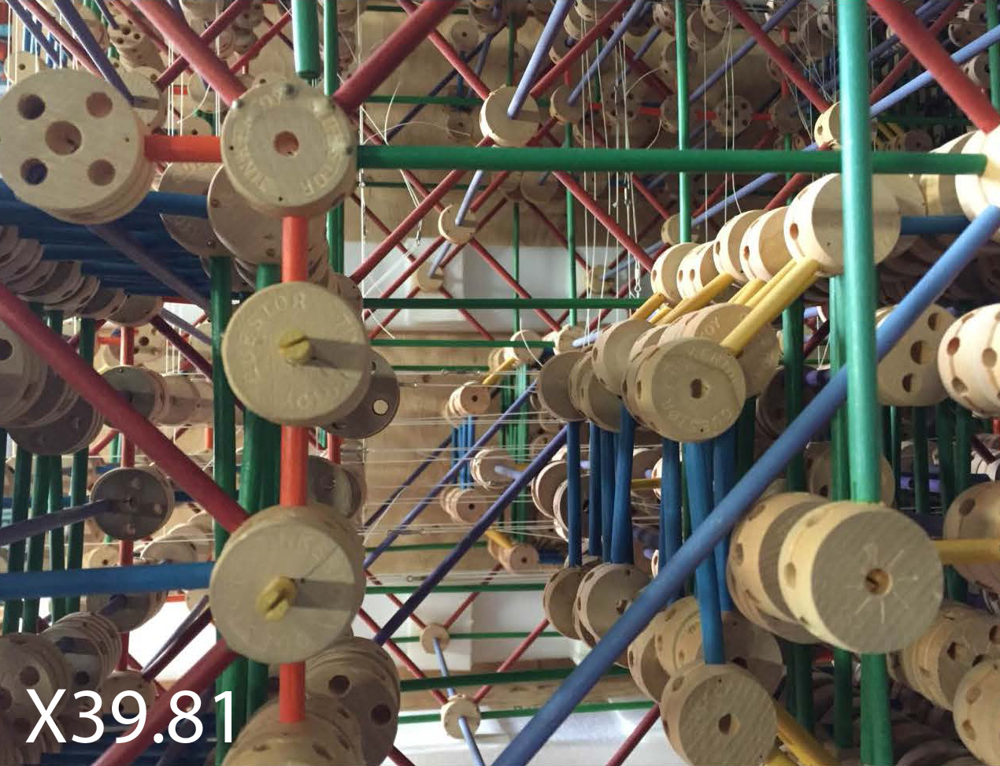
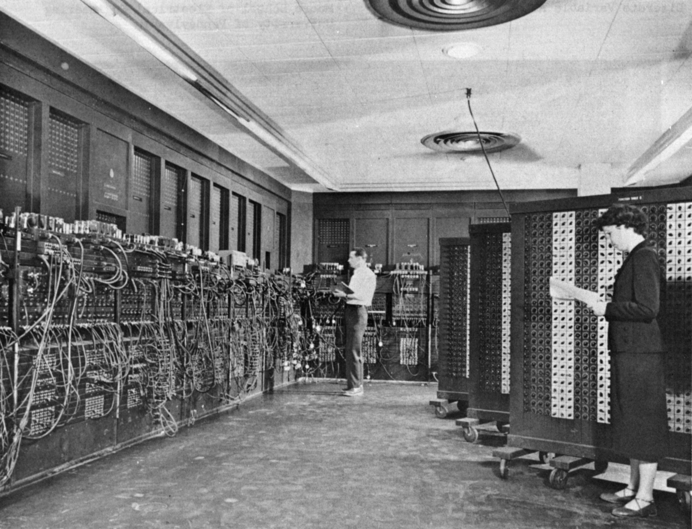
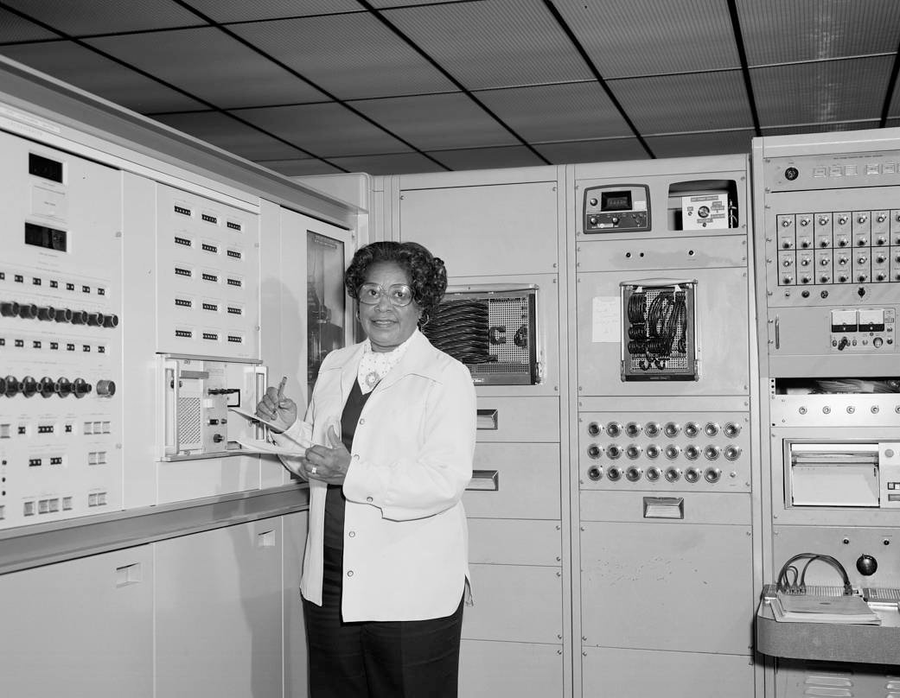

CS3100 - Module 0 - Lecture 01 - Mon Aug 26

# Topics:
* Get to know your professor
* What can I expect from this course?
* "What is a computer?" mud card activity
* "Get to know you" mud card activity

----------------------------------------------------------------------------
# Get to know your professor

Hi, I'm Erik Falor, and I'll be your professor this semester.

I graduated with a Master's degree from USU in 2017 and have been teaching here
ever since.  Before that I worked as a software engineer for 13 years.

## I don't like
* Desktop Environments
* Windows (TM)
* QWERTY
* Squishy keyboards
* Bic pens
* Rap music
* Country music

## I do like
* Window managers
* Linux
* My custom keyboard layout
* Mechanical keyboards
* Fountain pens
* Long walks in the woods
* Every other genre of music ever, without exception

----------------------------------------------------------------------------
# What can I expect from this course?

* Course module structure 
    * Course rules & Syllabus quiz
    * [Course Rules](https://gitlab.cs.usu.edu/erik.falor/fa19-cs3100-lecturenotes/blob/master/Course_Rules.md)
* Course outline
    * Chapters 1-10 of textbook
    * Most assignments are written in Java
* Assignments
    * Design & brainstorm with study buddies
    * Write code individually
    * Submit to GitLab only; nothing to do on Canvas
    * Tutor Room Hours
        * Mon - Fri: 10AM to 9PM
        * Sat: 12PM to 9PM
* Examinations
    * **Two** exams in this class
    * Schedule a spot in the Testing Center now
* Class participation
    * In-class activities & lecture attendance
    * Designated questioner

----------------------------------------------------------------------------
# "What is a computer?" mud card activity

I'll often ask you to turn in a "mud card" at the end of class.  The name comes
from "muddiest point".  You will reflect upon what was discussed in a lecture
and write a brief note explaining what you did not understand or a new question
raised by what you learned.

This serves the following purposes:

1. Provides a quick head-count of who attended today
2. Putting into writing what you learned in a day improves recall
3. Lets me know which topics were well received, and which need another approach
4. Gives another opportunity for you to ask a question in a non-intimidating way

At the top of your mud card please legibly write your name and A#.

### 1. Is this a computer?

### 2. How about this?

### 3. Or this?

### 4. If that was a computer, then this is definitely a computer

### 5. This, then, certainly is a computer

### 6. How many computers are captured in this photo?

----------------------------------------------------------------------------
# "Get to know you" mud card activity

On the other side of your mud card please write the following:

1.  What is your class (Sophomore, Junior, etc.) and major degree?
2.  Why are you enrolled in this course?
3.  What is your favorite meme?
4.  What type of music do you like the best?
5.  What do you like to do for fun?
6.  What is a good way for you to send pictures of mud cards to me?
7.  Should I spend a lecture on "how to use git", or move on to something else?
8.  Names of at least 3 of your neighbors and something unique or interesting about them
9. Who are your study buddies in this class?
