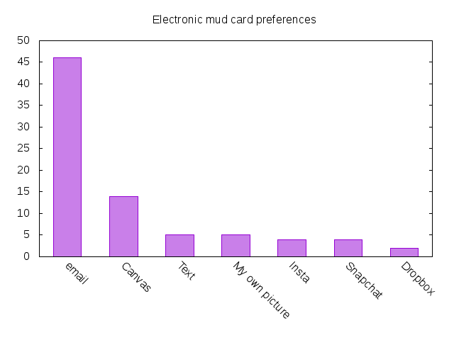

CS3100 - Module 0 - Lecture 03 - Fri Aug 30

# Announcements

## Assignment due dates have been adjusted

As explained in a previous lecture, a correction has been applied to the due
dates of assignments in Canvas, shifting most due dates up by one week.

## Labor Day Holiday
* No class on Monday, Sept 2
* We'll resume on Wednesday, Sept 4

## Free software and Linux Club
* Opening meeting
* Get acquainted with Linux and Open Source Software
* Wednesday, Sept 4 6pm @ ESLC 053

# Topics:
* Mud card followup
* Assignment #0 pointers
* How do I use Git to submit my homework?

----------------------------------------------------------------------------
# Mud card followup

*   Before our discussion about this on Wednesday, many of you agreed with the
    definition of **computer** as found on Wikipedia, insofar as automation is
    concerned.  What did you think of that electronic slide rule?
    [The Electric Slide Rule](https://www.youtube.com/watch?v=MEyIppEOQTw)

*   Electronic mud card submissions will be done by email
    

*   Participation points will begin to show up after the add/drop date passes
    next week.

----------------------------------------------------------------------------
# Assignment #0 pointers

*   I added links to the official Java documentation for the `BigInteger` and
    `BigDecimal` classes to the assignment on Canvas.
*   You *don't* actually need five git commits in this assignment's repository;
    I misspoke about that.
*   If you don't know how to compute the value of `e` with *iterations*,
    re-read the assignment description for a hint.
*   Don't type the characters `[`, `]` in the shell; it will misinterpret them.
*   `-fac` for very large values will take a *long* time to compute.  On my PC
    `java Assign1 -fac 20000` took 0.6 seconds and `java Assign1 -fac 200000`
    took nearly 30 seconds to complete.  My trial of `-fac 2147483647` is still
    running, and likely won't finish before the assignment is due.  Remember,
    this assignment is about compiling and running Java programs from the
    command line, and passing arguments from the CLI to `main()`.  It is *not*
    about algorithms.  Don't go down the optimization rabbit hole.

----------------------------------------------------------------------------
# How do I use Git to submit my homework?

I amended this document to include detailed instructions about setting up
your first git repository:

* [Git repository set up instructions](../Git_Repository_Setup.md)

These eight fundamental git commands are enough to succeed in my class:

1.  ~~git status~~
2.  ~~git init~~
3.  ~~git add~~
4.  ~~git config~~
5.  ~~git commit~~
6.  git remote
7.  git push
8.  ~~git log~~

On Wednesday we covered the ~~struck through~~ commands; today I'll show you
how to use the remaining commands.

