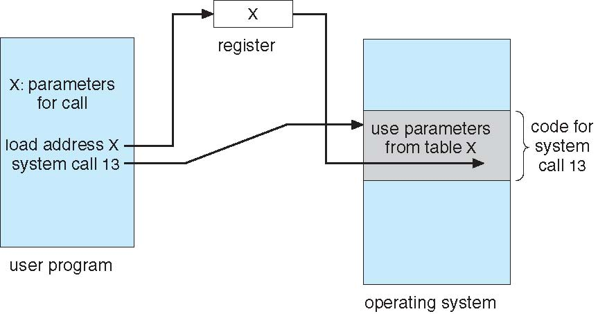
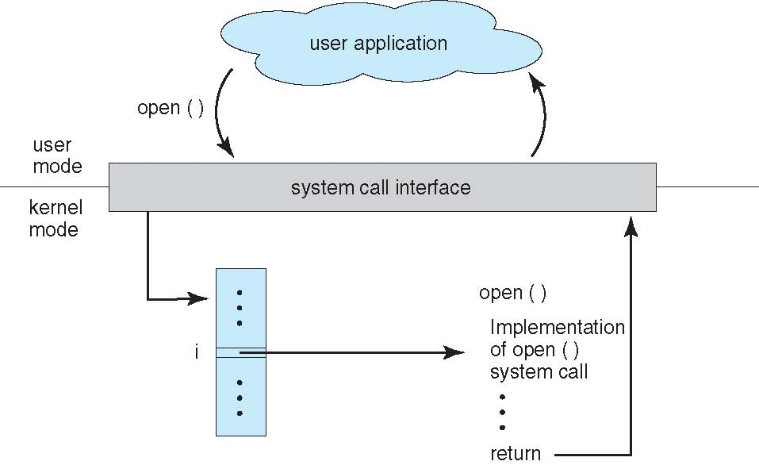

CS3100 - Module 1 - Lecture 08 - Fri Sep 13

# Announcements

# Call on 2 designated questioners

# Topics:
* 2.3 How do function parameters cross from user into kernel mode?
* 2.4 Types of syscalls
* 2.5 System programs

--------------------------------------------------------------------------------
# 2.3 How do function parameters cross from user into kernel mode?

There are three primary methods:

## 1. CPU registers

* Pros: Registers are really fast; this works just like an ordinary function call
* Cons: CPU registers are very small and few

## 2. A block or table of memory; just put the address to this block into one register
This is the method used by Linux and Solaris

* Pros: No size limit
* Cons: Slower than registers

## 3. The program call stack

* Pros: Convenient for the CPU/Kernel to use; more space than registers
* Cons: Same as #2

This choice defines an *Application Binary Interface* (ABI)

The reason a C++ program which performs an I/O operation can be compiled and
run on different Operating Systems (e.g. Linux and Windows) is *not* because
each of those OSes use the same underlying system call API for I/O.  It is
because the C++ language's system-call interface handles those details for you.

----------------------------------------------------------------------------
# 2.4 Types of syscalls

System calls are how your application makes use of the services that the
Operating System provides.  Looking forward to Assignment 2, you will be
studying system calls from these categories:

## Process Control

+ chdir()
+ nice()
+ sleep()
+ fork()
+ wait()

## File Management

+ open()
+ read()
+ write()
+ close()
+ mkdir()
+ stat()
+ link()
+ symlink()
+ unlink()

## Device Management

+ dup2()
+ sync()
+ ioctl()

## Information Maintenance (find out info about my own process)

+ getcwd()
+ getpid()

## Communication

+ kill()
+ msgget()
+ msgrcv()
+ msgsnd()
+ semctl()
+ semget()

## Protection

+ ulimit()
+ chgrp()
+ chmod()
+ chown()
+ chroot()
+ access()

## How Context Switches happen

Remember that a context switch is when your process makes a system call which
causes kernel code to run, and the CPU changes from user mode into the kernel
mode

1. Execution control passes from my user process into the system call's function in the kernel
2. The CPU hardware switches into its privileged mode (a.k.a. kernel mode)
3. The kernel is allowed to a privileged operation
4. Finally, when the privileged operation is complete, the execution control returns to the calling process

----------------------------------------------------------------------------
# 2.5 System programs

Many system programs on Unix are simple programs providing a command-line
interface to an API call of the same name:
 
* `chgrp`
* `chmod`
* `chown`
* `chroot`
* `mkdir`
* `nice`
* `sleep`
* `stat`
* `ulimit` (see note below)

Other system programs don't share the name of the system call they wrap, but otherwise 

* cd  -> `chdir()` (see note below)
* ln  -> `link()` and `symlink()`
* rm  -> `unlink()`
* pwd -> `getcwd()` (see note below)

*Note*: `ulimit`, `cd` and `pwd` aren't technically *system programs* but
rather conveniece commands provided by your shell (e.g. bash)

