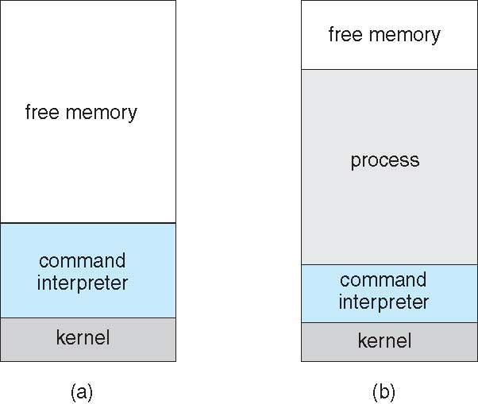
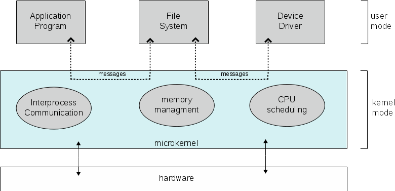

CS3100 - Module 1 - Lecture 09 - Mon Sep 16

# Announcements

## Hill AFB STEM Recruitment

Juniors: Come get an internship this coming summer.  Visit the table downstairs
on 1st floor of ENGR.  Interviews next week.

If you want to get your Master's degree, Hill will *pay* you to do it!
You don't have to show up to work while you're in school.

Seniors: We're looking for new hires *right now*.  Bring a resume today or
tomorrow to 1st floor of ENGR, visit a hiring supervisor right away.

## FSLC Guest Presentation: Thomas Hatch & Tyler Johnson of SaltStack 

I am pleased to announce two special guests from SaltStack will visit our next
meeting.

SaltStack is a Utah tech-startup that created an open-source project called Salt.
Salt is a Python-based configuration management software and remote execution engine.

Thomas Hatch & Tyler Johnson will introduce *Plugin Oriented Programming*
(POP), an exciting, new way to design large-scale software projects.  Learn
what it's like to work on an real-life project and how *you* can get involed in
open-source development right now.

Pizza will be provided.

ESLC 053 at 6PM Wednesday 9/18

# Call on 2 designated questioners

# Topics:
* 2.6.2 Mechanisms vs. Policies
* 2.6.3 OS Implementation
* 2.7 Operating System Structure
* The Tanenbaum–Torvalds debate

----------------------------------------------------------------------------
# 2.6.2 Mechanisms vs. Policies

#### Mechanism
* *How* to do something
* The actual, nitty-gritty code

#### Policy
* *What* to do when a mechanism is to be enacted
* *When* to enact a mechanism
* The "rules"

These ideas are separated from each other to maximize flexibility

## Examples of Policies:

* All processes must have a unique ID number
* Users can't access files belonging to other users
* Processes cannot access the memory of other processes

## Examples of Mechanisms:

* Maintain a list of in-use PIDs, don't assign a new process a number from that list
* User and group ownership of filesystem objects; permission bits on each file and directory
* Process ownership of memory regions; permission bits in the kernel's memory table

----------------------------------------------------------------------------
# 2.6.3 OS Implementation

OSes historically were written in assembly language (ASM)

*   ASM is tightly related to a particular CPU
*   OSes were tightly related to particular CPUs
*   An OS needs to be super-efficient, ASM gives high level of control

OSes now are written in high-level languages, primarily C and C++

* As compiler technology improves, so can the OS (sort of a "for free"
  performance improvement)
* Easier to write, debug and port to other kinds of hardware

#### Port(v)
To refactor/rewrite software designed to operate on one platform to run on
another

----------------------------------------------------------------------------
# 2.7 Operating System Structure

## MS-DOS - 'member DOS?
* MS-DOS was designed to be light on resources
* not a multitasking, multi user system - didn't need to be complex
* example of a monolithic system

#### Monolithic
1. Formed of a single large block of stone
2. (Of an organization or system) large, and intractably indivisible and uniform

### Advantages of Monolithic design
* Small - less to go wrong, more reliable
* Small - much less resource intensive
* Cheap to develop, maintain, etc.

### Disadvantages of Monolithic design
* Difficult to update - can't do a live update
* If there are parts of the OS I just don't need (e.g. a device driver for
  a mouse I don't have), I'm out of luck and have to spend the RAM on
  holding it in memory
* inflexible for different users - difficult to customize to your needs
* Single point of failure - if part of it crashes, the whole thing crashes

----------------------------------------------------------------------------
# 2.7.2 The Layered Approach to OS design

What are the layers?

1. Hardware
2. Device drivers
3. ???
N. User interface / API

## Microkernel OSes

Kernels tend to become big and complex over time. More complexity -> more bugs in the privileged lower layer.

Carnegie Mellon University developed _Mach_, a modular, microkernel OS

Only the most important services remain in the kernel (Layer 0)

Other services are implemented as daemons which communicate via message passing

### Advantages of Microkernel design
* Security advantages - if you hack a daemon, you didn't hack the whole OS
* No single point of failure
* Only use what you need
* Divide the labor of design & development

### Disadvantages of Microkernel design
* More costly in terms of memory, CPU time, etc.
* Must necessarily be a multi-tasking system
* Message passing becomes a bottleneck (vs. shared memory)
* More interactions and interdependencies => more potential for bugs
* Smaller attack surface means fewer critical vulnerabilites

## Hybrid approach: Loadable kernel modules

Tries to give the best of both worlds; a monolithic kernel can have a small
core, but pick and choose new parts to load into memory

On Linux these system programs are used to inspect and manipulate kernel
modules:

* lsmod
* rmmod
* insmod
* modprobe

### Advantages of loadable kernel modules
* Easier to port the OS to different architectures
* If there are parts of the OS I just don't need (e.g. the driver for a Wacom
  pen), I don't need to load it

--------------------------------------------------------------------------------
# The Tanenbaum–Torvalds debate

A.K.A. The flame war to end all flame wars on Usenet.  Usenet was a message
board built using pre-web technologies.  It was most popular among college
students/faculties and computer power users from the early 80's through the mid
90's.  It's decline began in 1993 when America Online made it accessible to
normies.  The advent of the world-wide web and increasing use by pirates 

Structurally and culturally I'd say it most resembles Reddit; users made posts
to newsgroups organized by topics.  Unlike Reddit, Usenet newsgroups were
organized hierarchically.

* [The original Usenet discussion](https://groups.google.com/d/msg/comp.os.minix/wlhw16QWltI/XdksCA1TR_QJ)
* [Wikipedia's write-up](https://en.wikipedia.org/wiki/Tanenbaum%E2%80%93Torvalds_debate)

## Tanenbaum: LINUX is obsolete

* Writing a monolithic kernel in 1991 is "a giant step back into the 1970s"
* Linux is too-closely tied to the 80386 processor, which won't catch on
* Being monolithic and specific to the 80386 means Linux will be unportable

> Don't get me wrong, I am not unhappy with LINUX.  It will get all the people
> who want to turn MINIX in BSD UNIX off my back.  But in all honesty, I would
> suggest that people who want a **MODERN** "free" OS look around for a
> microkernel-based, portable OS, like maybe GNU or something like that.

## Torvalds: Time for some serious flamefesting!

> I'd like to be able to just "ignore the bait", but ...  

* You make Minix as a hobby; I make Linux as a hobby, but I don't use that as
  an excuse for poor performance. "Linux still beats the pants of minix in
  almost all areas"
* I agree that micro-kernels are nicer, but "minix doesn't do the micro-kernel
  thing very well, and has problems with real multitasking" (read: multithreading)
* Linux may be less portable, but using the advanced 80386 features simplifies
  its design

