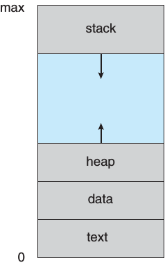
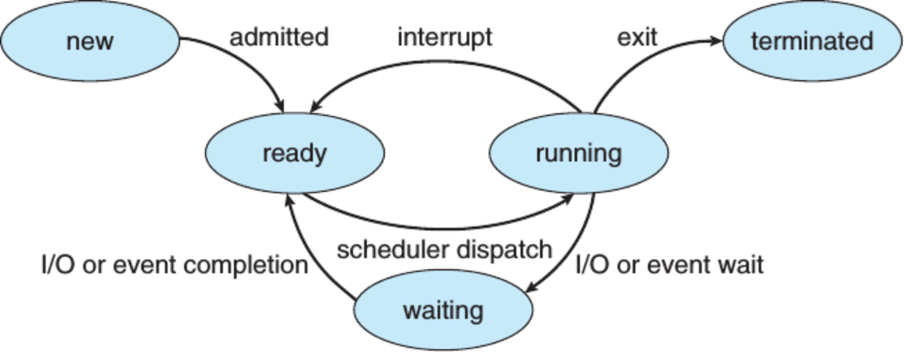
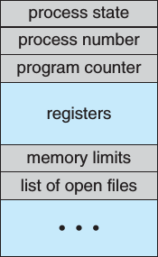

CS3100 - Module 2 - Lecture 11 - Fri Sep 20

# Announcements

## If you don't have a Raspberry Pi for Assignment #2

Contact me to check one out.


## Fall STEM Career Fair

Come network with some of the top firms in the science, technology,
engineering, and mathematics industries! This is a great way to take advantage
of setting up your next internship or full-time job after graduating college.
Also, expand your net work by meeting recruiters face-to-face. Companies span
from the FBI to IM Flash!

Monday 9/23 3pm-7pm @ the TSC


## CyberSecurity Special Interest Group meeting

Tuesday 9/24 6pm @ HH326

Ryan Beckstead will be presenting on how to clean up your computer, scan for
viruses and some router configurations.   

If you've expressed interest in competing in the DOE Cyberforce competition in
November, this is the place to be.


# Topics:
* 3.1 What is a process?


----------------------------------------------------------------------------
# 3.1 What is a process?


*Remember:* a process and a program are two different things

#### Program
Code sitting idle on a disk

#### Process
A program that is executing


A program has certain regions of data which do different things in the running process.

#### Text Section
Part of a program containing machine-code instructions

#### Data section
Part of a program containing hardcoded data & global variables


Certain parts of a process don't exist on disk: they are only needed when the
process is executing

#### Program Counter
CPU Register pointing to the next instruction to run

#### Stack
region of memory containing temporary data used by the process for local
variables and function calls

#### Heap
region of memory which the program may allocate as needed. can also be deleted as needed.





We can inspect the regions of a program on Unix with the ```objdump``` utility

    $ objdump -Ssdx executable | less


## 3.1.2 What states may a process be in?

This is not an exhaustive list, nor are these exact names used across all OSes.
But these concepts do exist across all modern OSes.

* New - The process is being created by the OS but hasn't yet started executing
* Running - The instructions in the process's text section are being executed
* Waiting - The process is waiting for an external event (I/O, Signal, etc.)
* Ready - The process is done waiting, and may be taken up by the next available CPU
* Terminated - The process has finished and the OS is in the midst of cleaning it up

This figure describes the lifecycle of a process on our system from birth to death.



As you run and watch your programs, see if you can determine which system calls
cause a process to move from the running queue onto the waiting queue.


## 3.1.3 How does the OS keep all of this straight?

What information might the kernel need to remember about a process? 

* Position of the instruction pointer
* State of CPU registers
* State of the call stack
* PID
* Open sockets, files, other data resources


#### Process Control Block (PCB)




Where it makes sense, the PCB will maintain separate copies of some of the
above information for each *thread* within a process.

The data recorded within the PCB is also known as the *context* of the process

