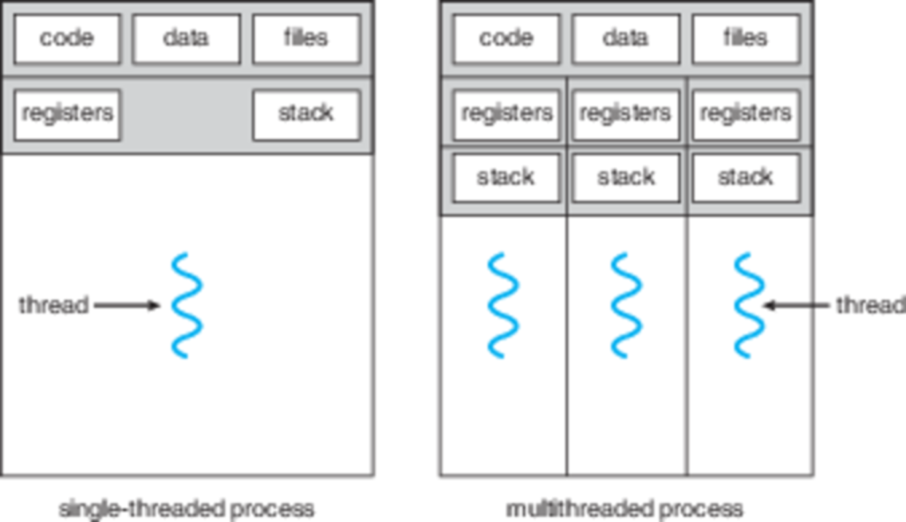

CS3100 - Module 2 - Lecture 15 - Mon Sep 30

# Topics:
* Mudcard activity: Compare/Contrast Shared Memory and Message Passing
* 4.1 What are the advantages of multiprocessing?
* 4.2 Multicore programming
----------------------------------------------------------------------------
## Mudcard activity: Compare/Contrast Shared Memory and Message Passing

Discuss with your study buddies these questions.  Record your ideas and
questions on your mudcards.

*   Can a process share memory with another process without getting the OS
    involved?

*   Can a process pass a message to another process without getting the OS
    involved?

*   What does "blocking" mean?  Give an example.

*   What does "non-blocking" mean?  Give an example.

*   What do you think happens to the sender when a message is put into a
    bounded-capacity message queue that is not full using blocking `send()`?

    *   What happens to the sender when that queue is full?
    
    *   What if the queue uses non-blocking `send()`?

*   Describe what happens when messages are exchanged over a zero-capacity
    buffer using blocking `send()`/`receive()`

----------------------------------------------------------------------------
## 4.1 What are the advantages of multiprocessing?

* Prevent the appearance of "freezing"
* You can get things done faster; slow programs can wait in parallel, and I'm
  always using the CPU to the fullest
* Support multiple users on one computer

What could happen if we let individual processes partake in multiprocessing?

#### Responsiveness
Your application can do slow stuff "in the background" while the UI always appears to be "fast"

#### Resource sharing
Separate "processes" can share memory space w/o needing to get the OS involved

#### Economy
Spawning threads uses less overhead than forking; context switching between threads is quicker than processes, too

### Behold, THREADS!

One program image with a single, unified memory space, multiple call stacks and PCBs to enable one program to use multiple CPU cores at once!

### 4.2.1 Challenges of multithreaded systems

1. Finding Tasks
    *   What can be done in parallel?

2. Balance
    *   If we parallelize, do we gain enough speed to offset the overhead?

3. Data Splitting (Spillman data massage program)
    *   Can the data be partitioned among threads? If it can, we call this an
        "embarassingly parallel" problem.
    *   Examples: Image processing

4. Data Dependencies
    *   Can we partition the data such that threads don't need to be
        "downstream" from other threads?
    *   An assembly line (or our shell's pipelines) aren't parallel systems

5. Testing & Debugging
    *   When there's more going on, there's more to go wrong.
    *   Debugging parallel systems is *notoriously* difficult

----------------------------------------------------------------------------
### 4.2.2 Types of parallelism

#### Data parallelism
Distribute subsets of data across cores & do same operations on different data

Example: GPUs rendering a 3D scene

#### Task parallelism: each core/thread is doing different operations

Example: GUI application where 1 thread manages the UI, and other threads do
slow tasks "in the background"

Real Talk - this isn't an either-or proposition.  Most applications are a hybrid
of these two approaches.

