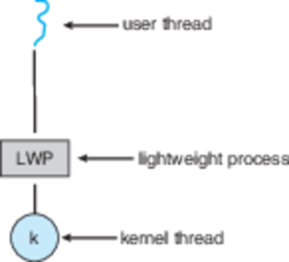

CS3100 - Module 2 - Lecture 16 - Wed Oct 02

# Announcements

## FSLC meeting tonight

[piVPN](https://github.com/pivpn/pivpn)

Simple OpenVPN installer, designed for raspberry pi

* Wednesday, 10/2
* 6pm @ ESLC 053

## DC435 meeting this Thursday

**Docker + ELK == win by Jeff Murray**

* Learn how to spin up elk instance inside docker and stuff
* We currently meet at Bridgerland Technical College campus
* 1301 N 600 W, Logan
* Room 840
* The room will open at 6:30 and meeting will kick off at 7:00pm.

# Call on 2 designated questioners

# Topics:
* Introduce Assignment #3
* 4.2 Amdahl's Law and the limits of multicore programming
* 4.3 What implementations of multithreaded systems exist?

----------------------------------------------------------------------------
# Introduce [Assignment #3](https://usu.instructure.com/courses/547959/assignments/2699284)

The infamous Command Shell assingment.

I've given you an extra week to work on this assignment: it's not due until
*after* fall break.  Don't procrastinate!  It really is this big of an
assignment!

----------------------------------------------------------------------------
# 4.2 Amdahl's Law and the limits of multicore programming

One processor juggling four tasks can use concurrency to spread the work out
evenly such that a little slice of each task gets its turn on the CPU
frequently and fairly:

When we add more CPUs we can do N things at once, leading to a speedup of a
factor of N:

A problem I can avoid simply by throwing money at it?  I love these!  And I'm
positive that there are no downsides or pitfalls at all!

### Amdahl's Law

The meaning of the variables in this image:
===========================================

* `S_N` = speedup I get from N CPUs
* `P` = proportion of the code which is parallel in nature
* `N` = # of CPUs

What do you think happens as `N -> +inf`?

[Amdahl's calculator](https://docs.google.com/spreadsheets/d/1BCEXj0oc7Nwfnq-cureAlqPQ_a6Vu7mPshjZCn95VCg/edit?usp=sharing)

*   Adding extra cores becomes less helpful
*   The total possible speed-up becomes the reciprocal of the proportion of the
    program that runs serially
    *   The less serial code there is the faster we can go
    *   Unfortunately, minimizing the amount of serial code is *really hard*

----------------------------------------------------------------------------
# 4.3 What implementations of multithreaded systems exist?

#### User Threads (a.k.a. Green Threads)
All of threads' bookkeeping is handled in user space

**User Thread Pros**
*   Fewer system calls = less OS overhead
*   Not terribly difficult to implement in some languages
*   Implementation may benefit from language/app-specific insight

**User Thread Cons**
*   Very difficult to implement in some languages
*   Each language/runtime system re-invents this wheel
*   Can't leverage multiple cores
*   When one thread makes a blocking system call *the entire* app is blocked

Green Threads were so named because they were created by the Green team at Sun
Microsystems for use in early versions of the Java Virtual Machine (the modern
JVM uses *real* multithreading).  It is still used by many programming
languages which claim to support "threading".  Because you can't *really* use
all of your CPUs this way, Java and C++ folks don't consider this to be _real_
threading.

#### Kernel Threads
All of threads' bookkeeping is handled by the OS

**Kernel Thread Pros**
*   All programs can benefit from a well designed scheduler (the OS has to do this anyway)
*   Can utilize separate CPU cores

**Kernel Thread Cons**
*   Thread operations are now a system call
*   Kernel bloat

## Pop Quiz - can you identify the type of threading?

I've written the same program in a few different programming languages.  Each
program spawns the following threads:

*   1 main thread which starts up the worker threads, then waits for them to
    finish (they won't...)
*   6 CPU-bound worker threads which increment `a` in a forever loop
*   1 I/O-bound worker thread which copies data from a slow disk device

Can you tell which implementation of threading (**kernel** vs. **user**) each
language uses just from watching the CPU graph in `htop`?

[Threads demo](../threads)

| Language | Program          | Threading implementation
|----------|------------------|-------------------------
| C++      | `threads.cpp`    | Kernel threads
| Scheme   | `threads.scm`    | User/Green threads
| Python2  | `threads_py.py`  | Hybrid (I/O can be done in parallel, CPU work is serial)
| Python3  | `threads_py.py`  | Hybrid - idem.
| Cython3  | `threads_py.py`  | Hybrid - idem.
| Java     | `threads.java`   | Kernel threads

