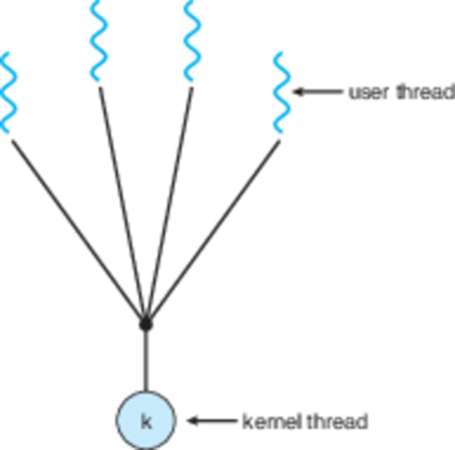
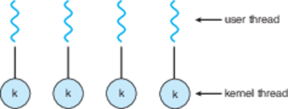
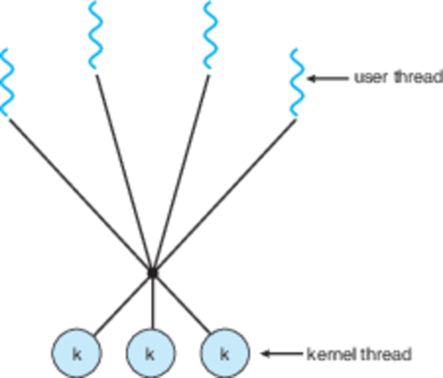

CS3100 - Module 3 - Lecture 17 - Fri Oct 04

# Call on 2 designated questioners

# Topics:
* 4.3 What implementations of multithreaded systems exist?
* 4.5 Cool Pool Party
* 4.6 What could possibly go worng with threading?

----------------------------------------------------------------------------
## 4.3.1 Many-to-one threads

For every user-space process there is at least one thread running in the kernel
ready to handle its system calls.

In this scheme many user-level threads share a single kernel thread.  When a
system call is made by one of the threads, the kernel thread is unavailable to
other threads within the process.

## 4.3.2 One-to-one

Each user-space thread gets its own kernel thread.

**One-to-one Pros**
* I/O-bound threads truly don't block the other threads
* The application can truly use all of your CPU cores

**One-to-one Cons**
* OS-specific code is needed
* You run into the kernel's limit on the number of threads

This is the model used by Linux, Mac, Windows and AIX

## 4.3.3 Many-to-many

A pool of user-threads is served by a (smaller) pool of kernel threads.  Each
time a user-level thread makes a syscall it can be handled by a different
kernel thread.

All of the benefits of one-to-one threading without the OS'es limitation on
number of threads.

## [Hyperthreading](https://en.wikipedia.org/wiki/Hyper-threading)

> Hyper-threading is Intel's proprietary simultaneous multithreading (SMT)
> implementation used to improve parallelization of computations (doing
> multiple tasks at once) performed on x86 microprocessors.

> For each processor core that is physically present, the operating system
> addresses two virtual (logical) cores and shares the workload between them
> when possible. The main function of hyper-threading is to increase the number
> of independent instructions in the pipeline; it takes advantage of
> superscalar architecture, in which multiple instructions operate on separate
> data in parallel. With HTT, one physical core appears as two processors to
> the operating system, allowing concurrent scheduling of two processes per
> core. In addition, two or more processes can use the same resources: If
> resources for one process are not available, then another process can
> continue if its resources are available.

----------------------------------------------------------------------------
# 4.5 [Cool Pool Party](https://www.youtube.com/watch?v=O6CNdlJp9c8)

* Even though threads are cheaper to make than processes, we're greedy people
  and want more performance.

* Or, we want to pretend that we have unlimited threads despite having a finite
  number of kernel threads.

A Thread Pool lets us maintain these illusions.

### This sounds too good to be true. How does it work?

0.  Spawn a number of generic threads at program startup time (when we won't
    notice how slow this is)
1.  Maintain a queue of tasks which our generic threads can execute
2.  There isn't a 1:1 correspondence between our tasks and the number of
    threads in the pool, so we can keep making up tasks and pretending that
    they each get their own thread
3.  The runtime environment can maintain the optimal number of threads for us,
    so we don't even have to worry about that detail.

----------------------------------------------------------------------------
# 4.6 What could possibly go worng with threading?

Here are some questions to think over:

* What should happen when a thread calls fork() or exec()?

* What should happen when a signal is received? Which thread has to drop what
  it's doing to handle it?  Assume that I installed the handler *before*
  spawning threads.

* What if you need to cancel a thread before it gets to a nice stopping point?

Here there are two possibilities for stopping a thread:

#### Asynchronous cancellation
One thread immediately and forcibly terminates the target thread

#### Deferred cancellation
The target thread periodically checks (possibly by looking at a global
variable) whether it should terminate.  Gives the target thread a chance to
clean up before it quits

## Storing data
What if a thread has data that is neither global nor local? Data on the heap
can be shared between all threads (this is, after all, one of the motivations
of threading as an alternative to forking processes).
  
But local variables only last as long as the current function call, and are
only visible to the current call stack; and a multi-threaded process as many
separate call stacks.
  
Thread Local Storage is the middle ground.

#### Thread Local Storage (TLS)
Memory which isn't in a threads call-stack, and which persists across function
calls, but isn't accessible to other threads within the same process.

TLS also has the advantage of cache-locality: if a thread is running
exclusively on the same CPU core, its TLS will likely stay on that CPU's main
cache.
