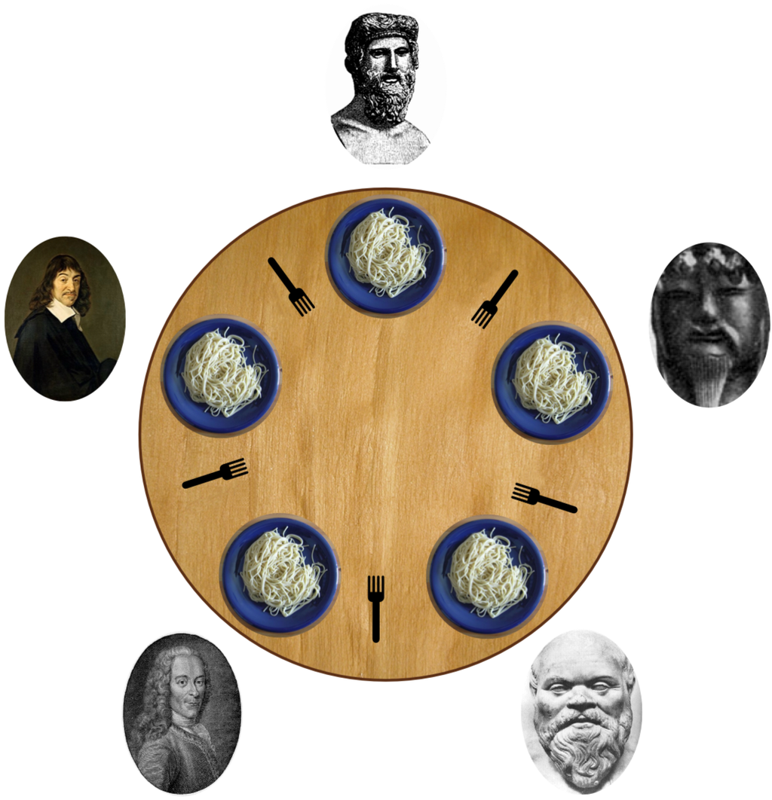

CS3100 - Module 3 - Lecture 20 - Fri Oct 11

# Announcements

## Mid-Term Exam is next week

The exam is open in the testing center Tuesday Oct 15th through Thursday Oct 17th.

Monday's lecture will be review of the material on the exam.

The lecture is canceled next Wednesday, Oct 16th, to give you plenty of time to study and take the exam.


# Topics:
* 5.7.3 The Dining-Philosophers Problem
* 5.6.3 Deadlocks and Starvation


--------------------------------------------------------------------------------
# 5.7.3 The Dining-Philosophers Problem

Philosophers (as perceived by Computer Scientists, anyway) spend their lives
alternatively thinking their big thoughts and eating.



Philosophers don't interact with their neighbors directly - small talk is too
far beneath the lofty heights of their metaphysical musings.

Occasionally, a Philosopher becomes hungry and will try to pick up the two
chopsticks adjacent to them (one at a time) to eat from a shared bowl of rice
(Philosophers are big on the philosophy that "sharing is caring").

They need both chopsticks to eat, and release both (one at a time) when they
are finished.

Ideally no Philosophers starve at this table.  Philosophers are smart people,
so this shouldn't be a problem, right?

In the case of 5 philosophers, there are six unites of shared data:

* One Bowl of rice (data set)
* Semaphore `chopstick[5]`, each element initialized to 1


Main loop of Philosopher *i*
----------------------------

```Java
while (true) {

    chopstick[i].wait(); // Grab the LEFT chopstick 
    chopstick[ (i + 1) % 5 ].wait(); // Grab the RIGHT chopstick 

    eatRice();

    chopstick[i].signal(); // Return the LEFT chopstick 
    chopstick[ (i + 1) % 5 ].signal();  // Return the RIGHT chopstick 

    thinkLoftyThoughts();

}
```


* Is there anything wrong with this algorithm?

* Can you do better?


--------------------------------------------------------------------------------
# 5.6.3 Deadlocks and Starvation

Like all things on a computer, there are a number of ways this can fall apart.

#### Deadlock
A situation where two or more processes are mutually waiting upon each other,
such that no progress is ever made.

The deadlocked processes are waiting indefinitely for an event that can be
caused by only one of the waiting processes; the cycle of waiting cannot be
broken.

#### Starvation
A situation where a process waits forever within the semaphore, never having a
chance to acquire its resource.  No progress is ever made.

## 5.7.2 The Readers-Writers Problem

Throughout our discussions of threads or processes accessing shared resources
we have broadly partitioned them into two classes, *producers* and *consumers*,
where both participants may modify the shared resource.

Another way to participate in a concurrent or parallel system is as
*readers* and *writers*.

#### Readers
May only read the data set; they do not perform any updates

#### Writers
Can both read and write the shared data set

The problem
-----------
Because readers don't modify the shared data, it makes no difference when many
of them to share simultaneous access.  However, if there is more than *one*
writer at a time, trouble will ensue.  Trouble may also arise if readers
attempt to access the shared data while the writer is in the midst of its work.

Several variations of how readers and writers are considered.  All involve some
concept of priorities.  The idea is to ensure that only one single writer can
access the shared data at a time.


Shared data
-----------
Semaphore `rw_mutex` initialized to `1`
Semaphore `mutex` initialized to `1`
`int read_count = 0`


Structure of the writer process
-------------------------------
```C
do {
    wait(rw_mutex);
    ...
    /* writing is performed */
    ...
    signal(rw_mutex);
} while (true);
```


Structure of reader processes
-----------------------------

```C
do {
    wait(mutex);
    read_count++;
    if (read_count == 1) {
        wait(rw_mutex);
    }
    signal(mutex);

    ...
    /* reading is performed */
    ...

    wait(mutex);
    read count--;
    if (read_count == 0) {
        signal(rw_mutex);
    }
    signal(mutex);
} while (true);
```


Readers-Writers Problem Variations
----------------------------------

* First variation - no reader is kept waiting unless writer has permission to use shared object
* Second variation - once the writer is ready, it performs the write ASAP

Both variations may have starvation, leading to even more variations

In practice this problem is solved by the kernel providing reader-writer locks

