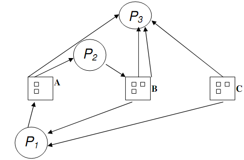
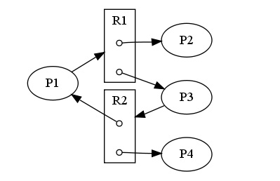
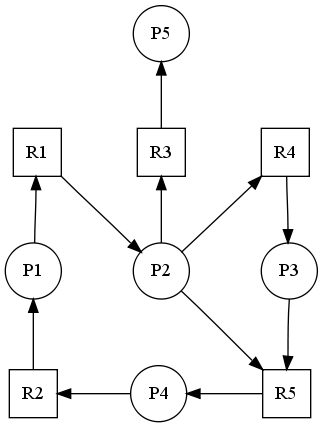
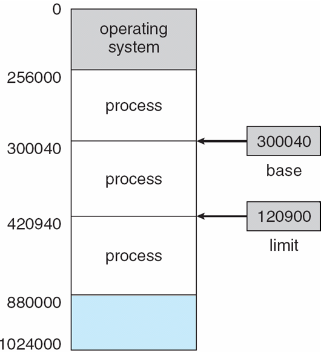

CS3100 - Module 4 - Lecture 27 - Fri Nov 01

# Call on 2 designated questioners

# Topics:
* Deadlock mud card activity
* 7.5.3 The Banker's Algorithm
* Chapter 8: Main Memory
    * 8.1 Background
    * 8.1.3 Logical Versus Physical Address Space

----------------------------------------------------------------------------
# Deadlock mud card activity

## Dining Philosophers' Problem

1. Draw a Resource Allocation Graph showing the Dining Philosophers' in
   deadlock.

2. Draw a Resource Allocation Graph showing the Dining Philosophers' when they
   are *not* in deadlock.

## Identify Deadlock

Together with your study buddies, decide whether each of the following images
describe an system in deadlock:

Is this system in deadlock?

**No** As soon as `P2` is done `P3` can proceed.

Is this system in deadlock?

**No** As soon as `P3` releases its resources `P1` or `P2` will be able to
proceed.

Is this system in deadlock?

**No** As soon as either `P2` or `P4` release their resources `P1` and `P3` will be able to proceed.

Is this system in deadlock?

**Yes** There are two cycles:

* `P1 -> R1 -> P2 -> R5 -> P4 -> R2 -> P1`
* `P1 -> R1 -> P2 -> R4 -> P3 -> R5 -> P4 -> R2 -> P1`

# 7.5.3 The Banker's Algorithm

Created by Computer Science legend and real-life wizard Edsger Dijkstra.

* [The original description (in Dutch)](https://www.cs.utexas.edu/users/EWD/ewd01xx/EWD108.PDF)
* [The mathematics behind the Banker's Algorithm](http://www.cs.utexas.edu/users/EWD/ewd06xx/EWD623.PDF)

The name refers the fact that this Algorithm could be used in a financial
system to ensure that a bank never allocates its available cash in such a way
that it can no longer satisfy the needs of its customers.

Each process must claim its maximum resource use before it it can make
requests.  Any one process cannot declare that it needs more resources than are
available.

When a process requests a resource it may have to wait if fulfilling the
request would leave the system in an unsafe state.

When a process gets all its resources it must return them in a finite amount of
time (progress).

This algorithm may require `O(m * n^2)` complexity.

* `n` = # of processes in the system
* `m` = # of types of resources available in the system

--------------------------------------------------------------------------------
# 8.1 Main Memory: Background

#### Physical
Pertaining to the actual, raw hardware

#### Logical
An abstraction; pertains to the perspective we impose upon the system for convenience's sake

## Problem #0: Speed

Most computers which you use are of the von Neumann architecture, which means
they use a single memory bank for both executable code and ordinary data.

At every instruction the CPU is reading from memory, either to

0. fetch instructions to execute
1. fetch/store the data those instructions operate upon

The CPU may only access two types of storage directly:

0. CPU Registers
1. Main Memory (RAM)

Any other storage (disk, DVD-ROM, network) must 1st be copied into one of these
locations in order for the CPU to even use them. This is slow.

Accessing main memory (RAM) is slow compared to accessing CPU registers. This
means that some CPU instructions cannot complete in their ordinary timeframe.

#### Stall
When the CPU cannot execute an instruction because it must wait for data to become available

A CPU stall is the hardware equivalent of sleeping on Disk I/O.

We wish to maximize computational throughput by minimizing stalls.

#### Cache
A small region of fast memory between the CPU and RAM intended to minimize stalling the CPU

## Problem #1: Protection

Once computers were built to support multiple processes and multiple users, we
began to need to protect these from each other.

Each process lives under the illusion that it's own memory space begins at
address 0. But this cannot literally be true for all processes simultaneously,
as each process may only access a portion of the entire physical address space.

The hardware itself is built to support a useful abstraction. In order to
create this partitioning of the physical memory space into multiple logical
spaces, the CPU provides two registers which denote the legal memory boundaries
for a process.

#### Base Register
Contains the smallest legal physical memory address for a process

#### Limit Register
Contains the size of the physical memory address space available to the process

The highest physical address a process may access is `base + limit`

Together, these registers map from "Logical" space to "Physical" space

Q. How does the CPU/OS know where to put the Limit Register?

