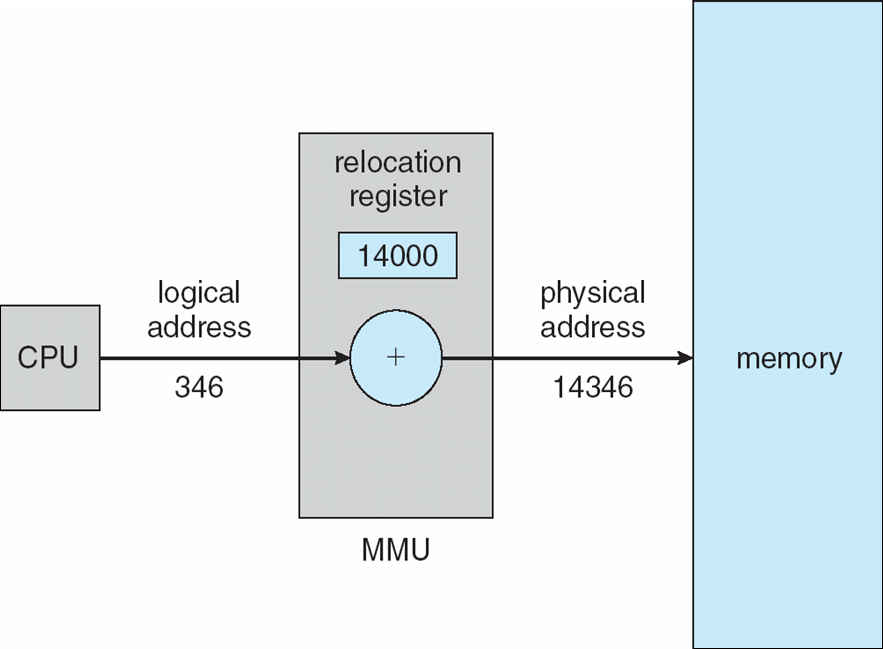

CS3100 - Module 4 - Lecture 28 - Mon Nov 04

# Announcements

## Aggies Dominated the Lucid Programming Competition

Congratulations to the USU teams who crushed the Lucid Programming Competition
this past Saturday.

[Lucid Programming Competition Leaderboard](https://contest.golucid.co/)

# Topics:
* Assn4 due on Wednesday
* 8.1.3 Logical Versus Physical Address Space
* 8.1.5 Dynamic Linking

----------------------------------------------------------------------------
# Assn4 due on Wednesday

What questions or issues do you have?

# 8.1 Main Memory: Background

The Operating System tries to strike a balance between three demands with its
approach to the main memory of a computer:

## *REVIEW* Problem #0: Speed

* Fetching instructions to execute
* Fetch/store the data those instructions operate upon
* Work with limited registers & RAM
* Minimize CPU stalls

## *REVIEW* Problem #1: Protection

Computers built to support multiple processes and multiple users need to
protect these from each other.

## Problem #2: Binding

Recall that a program is an inert entity on disk. When it is copied into RAM
and begins execution it becomes active, and those instructions encoded within
the program need to know where their addresses point to.

How can an on-disk program possibly know what values its base and limit
registers will take at runtime?

What if you have multiple instances of the same program running? Must they
share the same address space?

#### Binding
Mapping addresses within a program to locations within a processes' memory space 

Three possibilities exist here:

1.  *Compile-time binding*: Assign memory addresses statically within the
    program's text section.

#### Absolute code
Program instructions which encode physical memory addresses; the compiler
"knows" where this program will reside in memory when it's running

2.  *Load-time binding*: When the program is loaded the OS selects a value for
    the base register and edits all instruction's memory access operands to
    account for this offset

#### Relocatable code
Program instructions are modified at load-time to account, offsetting by the value in the processes' base register

3.  *Execution-time binding*: When an executable may be moved from place to
    place in memory at runtime, binding must be delayed until runtime. Special
    CPU hardware is required for this to be possible (MMU).

   This creates a 3rd kind of memory space called *virtual memory*.  We'll cover
   *virtual memory* in more depth in Chapter 9.  Mainstream OSes today use
   Execution-time binding.

Q. Does the OS itself load parts of itself with Execution-time binding?

# 8.1.3 Logical Versus Physical Address Space

#### Logical Address
An address generated by the CPU

These are addresses encoded within CPU instructions; sources and destinations
of data in operations.

#### Physical Address
An address seen by the memory unit

* Compile-time and Load-time binding generate *logical* and *physical* addresses.

* Execution-time binding generates another type of address, called a *virtual address*.

* The text uses the terms *logical address* and *virtual address* interchangably. smh

#### Memory Management Unit (MMU)
Hardware device which maps virtual addresses into physical addresses

# 8.1.5 Dynamic Linking

#### Statically linked libraries
System libraries which are treated as other objects, combined by the loader into the program image

#### Dynamically linked libraries (DLL)
System libraries linked to user programs at run-time

#### Shared Objects (SO)
The Unix jargon for DLL

DLL's allow a program to decide, at runtime, whether or not to include some
functionality, increasing program flexibility.  You can even add functionality
to a compiled program *after* the fact by providing a DLL with a compatible
interface.

#### Stub
Small bit of code which is replaced at run-time with the matching, dynamically linked code

The stub may include information about which version of the dynamic function is
required, or where to find it, etc.

### DLL Pros:

* Enables a plug-in architecture
* Bugfixes can be made without replacing the entire application
* Operational choices can be delayed as late as possible
* Multiple versions of a library may be installed, allowing old, legacy applications to continue operating

### DLL Cons:

* Increased overhead in time
    * Runtime system must search for a file
    * Time spent reading and loading the file
* Increased overhead in space
    * Stub code costs bytes
    * Each DLL has a fixed size overhead for boilerplate code
* Possible incompatibilities between client application and a shared library
    * The interface in the DLL might not match the driver code
    * An app can load a library that is too new or too old, leading to bugs or crashes
    * "DLL Hell"

[Demo: Dymanically Linked Library demo](dll/)

### Fun stuff to try:

* Create a separate implementation of the demo function in a different file;
  choose to load one library or the other at runtime

* Create a separate implementation of the demo function with a completely
  different signature; prompt the user to choose which one you want to use

