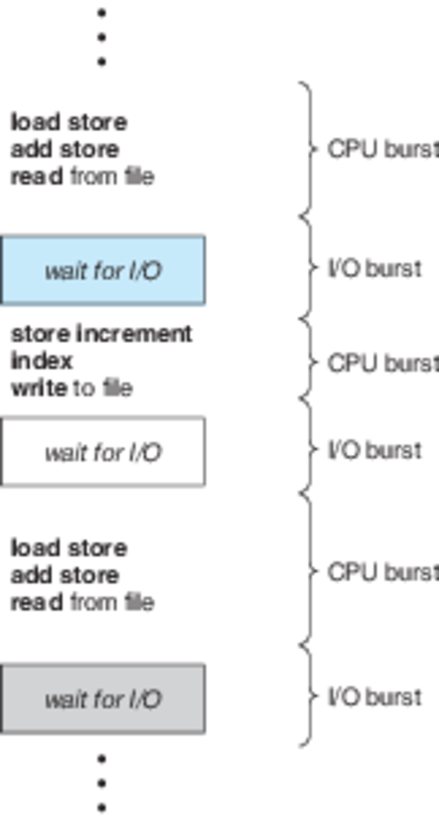
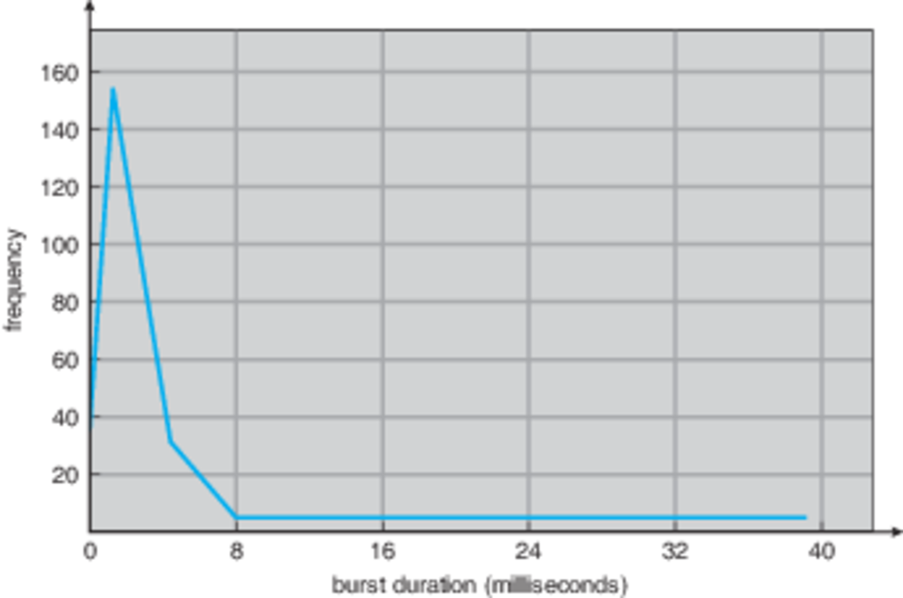

CS3100 - Module 4 - Lecture 23 - Wed Oct 23

# Announcements

## FSLC CyberHacker Movie Night

Tonight we are watching a classic movie about hacking that literally sparked
the creation of cyber-security in the US.  That's right we'll be watching the
movie *Wargames*. So come on down to ESLC 053 at 6pm to view this classic.

FSLC now has a [Discord!](https://discord.gg/RHppcek), and you're invited!

## Lucid Programming Competition

Join us for the 7th annual Lucid Programming Competition. Compete against teams
from universities across Utah for a chance to win an Amazon gift card worth up
to $300. It's always a good time—you won't want to miss it!

Register with your team or as an individual. Complete this form to secure your
spot in the competition: https://www.golucid.co/programming-competition

* Saturday, November 2, 2019
* 8:00 a.m. - 2:00 p.m.
* ENGR 108

# Call on 2 designated questioners

# Topics:
* 6.1.1 CPU-I/O Burst Cycle
* 6.1.2 CPU Scheduler
* 6.1.3 Preemptive Scheduling

--------------------------------------------------------------------------------

# 6.1.1 CPU-I/O Burst Cycle

Process execution consists of a cycle of CPU execution and I/O wait.

   I/O Wait -> CPU -> I/O Wait -> CPU -> I/O Wait -> CPU -> I/O Wait -> and so on.

Eventually, the final CPU burst ends with a system request to terminate execution.

## Key insights:

* An I/O-bound program typically has many short CPU bursts
* A CPU-bound program might have a few long CPU bursts
* Overall, bursts tend to be short

This distribution can be important in the selection of an appropriate
CPU-scheduling algorithm.

# 6.1.2 CPU Scheduler

a.k.a. short-term scheduler

#### CPU scheduler: selects a process from the processes in memory that are ready to execute

The list of processes on a system is conceptually stored in collection of
queues based on the state of the program (i.e. ready queue, I/O queue, etc.)

Note:
=====
The ready queue is not necessarily a first-in, first-out (FIFO) queue.  We'll
treat it like it is for convenience sake, but it could be implemented as a
different data structure

# 6.1.3 Preemptive Scheduling

There are 4 circumstances under which CPU-scheduling decisions may take place:

## The 4 circumstances

1. A process switches from the running state to the waiting state (for example,
   as the result of an I/O request or an invocation of wait() for the
   termination of a child process)
   
   "I'm at a good stopping point"

2. A process switches from the running state to the ready state (for example,
   when an interrupt occurs)

   "Timmy, let the other children have a turn now"

3. A process switches from the waiting state to the ready state (for example,
   at completion of I/O)

   "Your table is ready"

4. A process terminates of its own accord

   `return 0; // at the end of main`

### In circumstances 1 & 4, there is no choice for the OS scheduler to make

The process has made the scheduling decision for itself.

This situation is called "non-preemptive" or "cooperative" scheduling.  Under
this scheme, once the CPU has been allocated to a process the process keeps the
CPU until it releases the CPU either by terminating or by switching to the
waiting state.  Nothing can interrupt the process.

This scheme depends upon processes to give up their turns on the CPU

#### non-preemptive pro: Works on simple hardware w/o dedicated timers
#### non-preemptive con: Bugs in programs (e.g. an infinite loop or some other bug is encountered) causes the entire system to hang

### Circumstances 2 & 3, therefore, are considered "preemptive"

The preemptive method is used by all modern mainstream server & desktop OSes.

Preemption also affects the design of the operating-system kernel.  During the
processing of a system call, the kernel may be busy with an activity on behalf
of a process.  Such activities may involve changing important kernel data (for
instance, I/O queues).  What happens if the process is preempted in the middle
of these changes and the kernel (or the device driver) needs to read or modify
the same structure?

Chaos ensues.

#### preemptive pro: More robust against programs which don't share
#### preemptive con: Requires more a sophisticated and complicated OS
#### preemptive con: Can result in race conditions when data are shared among several processes

# 6.1.4 Dispatcher

#### Dispatcher: the module that gives control of the CPU to the process selected by the short-term scheduler

This function involves the following:

* Switching context
* Switching to user mode
* Jumping to the proper location in the user program to restart that program

#### Dispatcher latency: The time it takes for the dispatcher to stop one process and start another running 

The dispatcher should be as fast as possible, since it is invoked during every
process switch.

