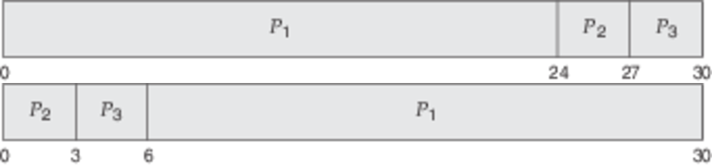
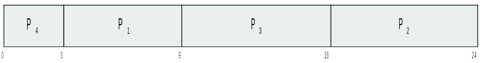
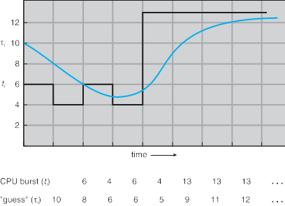

CS3100 - Module 4 - Lecture 24 - Fri Oct 25

# Announcements

# Call on 2 designated questioners

# Topics:
* Mudcard review
* Assignment #4 preview
* 6.2 Scheduling Criteria
* 6.3 Scheduling Algorithms
* 6.3.1 First-Come, First-Served Scheduling
* 6.3.2 Shortest-Job-First Scheduling

--------------------------------------------------------------------------------
# Mudcard review

# [Assignment #4 preview](https://usu.instructure.com/courses/547959/assignments/2699285)

# 6.2 Scheduling Criteria

There are many possible CPU-scheduling algorithms to choose from. Which one you
use affects the behavior of the system by favoring certain types of processes
over others.

Criteria which may be taken into consideration by the scheduler:
================================================================

* CPU utilization. In general, we want to keep the CPU as busy as possible.

* Throughput. If the CPU is busy executing processes, then work is being done.

#### Throughput: the number of processes that are completed per time unit

* Turnaround time. How long does it take to execute that process from start to
  finish?

#### Turnaround time: The interval from the time of submission of a process to the time of completion 

Turnaround time = Spawn time + CPU execution + I/O Wait + Waiting in ready queue

* Waiting time. The CPU-scheduling algorithm can't help how much time a process
  spends waiting for I/O, or how much computation a process must make. It can
  try to minimize the amount of time the process spends in the ready queue.

* Response time. Time from the submission of a request until the first response
  is produced.

#### Response time: the time it takes a process to start responding, not the time it takes to output the response.

In an interactive system, turnaround time may not be the best criterion. Often,
a process can produce some output fairly early and can continue computing new
results while previous results are being output to the user.

The turnaround time is generally limited by the speed of the output device.

### Takeaways:

* It is desirable to maximize CPU utilization and throughput and to minimize
  turnaround time, waiting time, and response time.

* Investigators have suggested that, for interactive systems (such as desktop
  systems), it is more important to minimize the variance in the response time
  than to minimize the average response time. A system with reasonable and
  predictable response time may be considered more desirable than a system that
  is faster on the average but is highly variable.

# 6.3.1 First-Come, First-Served Scheduling

The Good:
---------
The simplest scheduling algorithm of them all (just a FIFO queue)

The badly ugly:
---------------
Sensitive to the order in which processes arrive

This is a problem when the slowest process arrives first.

Given these processes, how will this algorithm schedule them?

|Process|Burst Time|
|:-----:|:--------:|
|   P1  |    24    |
|   P2  |    3     |
|   P3  |    3     |

What's the waiting time for each process?

|Process|Waiting Time|
|:-----:|:----------:|
|   P1  |    0       |
|   P2  |    24      |
|   P3  |    27      |

What's the *average* waiting time for all processes?

17.0

What's the *average* waiting time for all processes if the arrived in the order P2, P3, P1?

3.0

#### Convoy Effect: delay felt by all the other processes which wait for the one big process to get off the CPU

The [convoy](https://www.youtube.com/watch?v=Sd5ZLJWQmss) effect results in
lower CPU and device utilization than might be possible if the shorter
processes were allowed to go first.

This particular problem is most associated with FCFS scheduling

# 6.3.2 Shortest-Job-First Scheduling

Take advantage of the fact that we know all processes exhibit a CPU-I/O Burst Cycle:

CPU -> I/O Wait -> CPU -> I/O Wait -> CPU -> I/O Wait -> and so on.

The SJF algorithm associates with each process the length of the next CPU burst
(don't worry about where this length comes from just yet...)

The SJF scheduling algorithm is provably optimal, in that it gives the minimum
average waiting time for a given set of processes.

Given these processes, how will this algorithm schedule them?

|Process|Burst Time|
|:-----:|:--------:|
|   P1  |    6     |
|   P2  |    8     |
|   P3  |    7     |
|   P4  |    3     |

What order will the SJF scheduler place these processes?

P4, P1, P3, P2

What's the waiting time for each process?

|Process|Waiting Time|
|:-----:|:----------:|
|   P1  |    3       |
|   P2  |    16      |
|   P3  |    9       |
|   P4  |    0       |

What's the *average* waiting time for all processes?

7.0

What would the *average* waiting time for these processes be under FCFS?

10.25

The catch:
----------
The real difficulty is knowing the length of the next CPU request.

The short-term scheduler simply doesn't have enough information available to
know how long the next CPU burst will be. Our next best approach to predict
this is to approximate or estimate this duration.

The next CPU burst is generally predicted as an exponential average of
the measured lengths of previous CPU bursts.

