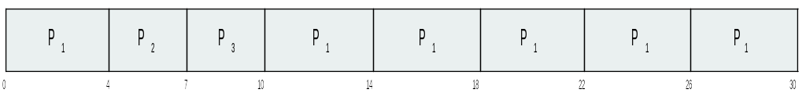
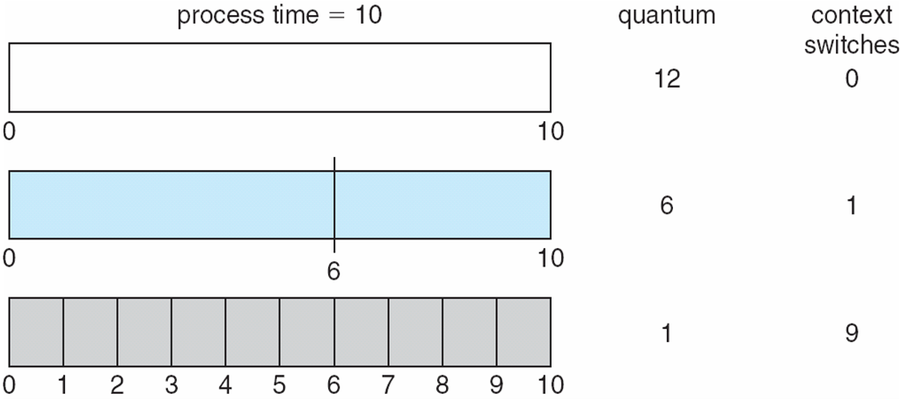

CS3100 - Module 4 - Lecture 25 - Mon Oct 28

# Announcements

# Call on 2 designated questioners

# Topics:
* 6.3.3 Priority Scheduling
* 6.3.4 Round-Robin Scheduling
* 6.3.5 Multilevel Queue Scheduling
* 6.5 Multiple-Processor Scheduling
* 6.5.2 Processor affinity
* 6.5.3 Load Balancing
* Assignment 4 Questions

# 6.3.3 Priority Scheduling

#### Priority Scheduling: Associate a priority rank with each process, selecting the highest priority process to execute next

Generally, smaller priority values are considered *higher* priority than larger
ones.

It's better to be in 1st place than 10th place. This mnemonic works until your
system (*cough* Linux *cough*) starts assigning *negative* priority numbers...
then it's better to be in -10th place than 1st place.

The priorities are not necessarily related to the expected burst times; they
may be set by the user according to their own whim.  Scheduling priority on
Linux systems can be set and changed with the `nice(1)` and `renice(1)`
commands.  On Windows you can adjust the priority of a running process with the
Process Explorer tool.

Suppose these processes arrive at the scheduler having been assigned these
priorities and with expected burst times.  They are scheduled thus:

|Process|Burst Time|Priority|
|:-----:|:--------:|:------:|
|   P1  |   10     |    3   |
|   P2  |    1     |    1   |
|   P3  |    2     |    4   |
|   P4  |    1     |    5   |
|   P5  |    5     |    2   |

What's the waiting time for each process?

|Process|Waiting Time|
|:-----:|:----------:|
|   P1  |    6       |
|   P2  |    0       |
|   P3  |   16       |
|   P4  |   18       |
|   P5  |    1       |

The average wait time is 8.2.  Remember, the burst time is *not* taken into
consideration in this decision: only the priority ranking counts!

Shortest-Job-First scheduling is a *special-case* of priority scheduling, where
the priority number is the inverse of the next predicted burst time.  The
shorter the next burst is expected to be, the higher the priority.

#### Starvation: A process which remains in the waiting queue forever becomes starved

Starvation can happen in Priority Scheduling for processes with really low
priority; they may never get a turn if there's always another process with a
higher priority.

#### Aging: Increasing a processes' priority as it sits on the wait queue

Through aging processes we can guarantee that they will get a turn *eventually*

# 6.3.4 Round-Robin Scheduling

Similar to FCFS, but with preemption so that process switches are guaranteed to
happen eventually.

#### Time Slice: a small unit of time which is the longest "turn" a process can take in the Running state.

a.k.a. "Time Quantum"

If there are `N` processes in the Ready queue, then each process will get `1/N` of
the CPU time, spread out over chunks in the size of the system's time slice.

If a process on the running queue doesn't make a system call (e.g. doesn't do
an I/O operation that might cause it to wait) the system preempts it when its
time slice expires, forcing it to the back of the Ready queue.

Given these processes burst times and a time slice of 4:

|Process|Burst Time|
|:-----:|:--------:|
|   P1  |    24    |
|   P2  |    3     |
|   P3  |    3     |

We get this many context switches:

#### RR drawback: Context switches are forced even when N = 1 and there is no need to share.

RR works well when the overhead of making a context switch is low.

In general, you want to scale your time slices such that they are significantly
longer than the time it takes to do a context switch; otherwise, you spend as
much time performing context switches as you do useful work.

Consider "Response Time" vs. "Turnaround Time"

#### Turnaround time: The interval from the time of submission of a process to the time of completion 
#### Response time: the time it takes a process to start responding, not the time it takes to output the response.

Generally, RR has higher *turnaround* time than SJF, but a lower *response* time

# 6.3.5 Multilevel Queue Scheduling

Which is better, RR or FCFS? Why choose when you can have both!

MLQ divides processes into two classes:

#### Foreground processes: interactive processes that people might see

Examples:
Your terminal, browser, word processor

#### Background processes: batch processes which humans won't notice 
Examples:
System daemons, scheduled backups, antivirus, system updates

### The Strategy
The difference between these processes is that they have different
response-time requirements.

We'll use a scheduling algorithm for those processes which need to feel more
responsive, at the expense of more context switches.

Processes which need to get a lot of work done in one stretch will benefit from
longer time slices and fewer context switches, and spending just a bit more
time waiting on the ready queue won't cramp their style.

We can also have more than just two queues, assigning priorities to processes
based upon who is using them, and what type of work they do (give the CEO the
highest priority so they don't throw a tantrum).

### Starvation warning!
There is a possibility of starvation with MLQ: we could spend all of our time
serving the foreground queue and leave the background queue on the back burner.

We might do have time-slices among the queues, so that we guarantee that at
least 10% of the CPU is devoted to background processes so that they aren't
neglected forever.

# 6.5 Multiple-Processor Scheduling

## Asymmetric multiprocessing
* Only one processor (the master) accesses the system data structures,
  alleviating the need for data sharing
* The other processes handle all user code
* Simple to implement

## Symmetric multiprocessing (SMP)
Each processor is self-scheduling. This means that either:
* all processes are in a common ready queue
* each processor has its own private queue of ready processes

Presently, this is the most common type of multiprocessing in mainstream OSes.

# 6.5.2 Processor affinity
The property that a process has an affinity for the processor on which it is currently running.

Why?

0. A process has accessed a lot of RAM while it was on processor 1. All of that
   data is cached in CPU 1's private, fast cache.
1. Moving this process over to CPU 2 means that we either copy the cache, or
   throw all of that data away, only to slowly read it back in from RAM

Keeping a process on the same CPU maximizes our return on investing in the
overhead.

There are two approaches to implementing processor affinity:
* soft affinity - we'll do our best to keep a process on the same CPU, but no
  guarantees.
* hard affinity - lock a process to a specific processor (or set of processors)

For example, Linux implements soft affinity, but has support for hard affinity.
See the man page for the `taskset(1)` command.

# 6.5.3 Load Balancing
Under SMP it is important to keep the work spread evenly across all CPUs so
that we can maximize utilization.

#### Load Balancing - attempt to keep the workload evenly distributed

Explicit load balancing is mostly needed on systems where each processor has
its own private queue of tasks; when a system uses a common ready queue load
balancing naturally takes care of itself.

It's easy to imagine why: when a processor becomes idle, it's immediately
assigned the next available task.

# [Assignment 4 Questions](https://usu.instructure.com/courses/547959/assignments/2699285)

What questions do you have about the upcoming assignment?
