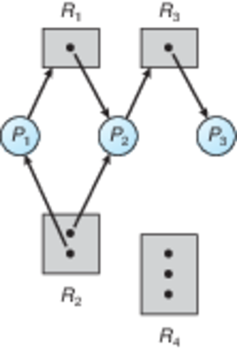
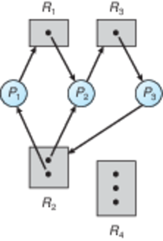
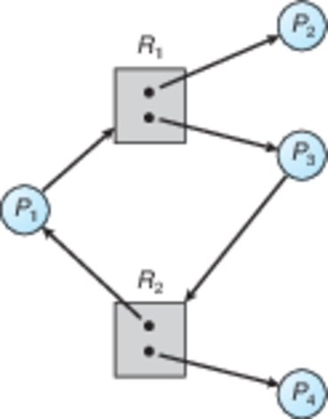
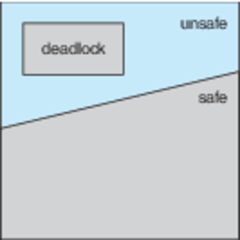
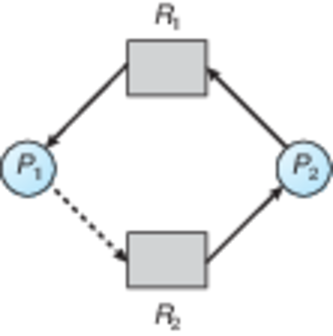

CS3100 - Module 4 - Lecture 26 - Wed Oct 30

# Chapter 7: Deadlock

# Topics
* 7.1 System Model
* 7.2.1 Deadlock Necessary Conditions
* 7.2.2 Resource Allocation Graphs
* 7.3 Methods for Handling Deadlocks
* 7.4 Deadlock Prevention
* 7.5 Deadlock Avoidance
* 7.5.1 Safe State
* 7.5.3 The Banker's Algorithm

--------------------------------------------------------------------------------
# What is "Deadlock"?

[Deadlock Demo in C++](deadlock/)

# 7.1 System Model

The system consists of N processes which are desired by M resources.

Of the N processes, each one may need a different subset of the M resources to
fulfill its task.

#### Resource Instances: Number of requests a particular resource my serve at one time

In this system, a resource may be used by a finite number of processes at a
time. Maybe the resource itself supports a limited amount of concurrency or
parallelism; perhaps we have 8 CPU cores or 3 printers, and it really doesn't
matter *which* device serves the request. The point is that the resource is
limited in some way.

Because each resource may be used by only so many processes at a time, we need
to protect their access with locks (or semaphores).

Each process utilizes a resource as follows:

0. **Request** 
   A process requests a resource, or waits until it becomes available

1. **Use** 
   The process uses the resource, making some progress with it

2. **Release**
   The process concludes its work, making the resource become available for
   another process

## 7.2.1 Deadlock Necessary Conditions

Deadlock can occur if these conditions hold simultaneously:

0. **Mutual Exclusion**
   Only one process at a time can use a resource
   (Either the resource has only one instance, or we're requesting the final
   available instance)

1. **Hold and Wait**
   Process holding one resource is waiting to acquire resource held by another process

2. **No Preemption**
   A resource can be released only be the process holding it after the process completed its task

3. **Circular Wait**
   Set of waiting processes such that .P_n-1. is waiting for resource from `P_n`,
   and `P_n` is waiting for `P_0`

   + "Dining Philosophers" in deadlock

## 7.2.2 Resource Allocation Graphs

We can visualize this system model with a Resource Allocation Graph (RAG), and
through examination identify deadlocked systems.

In a RAG the symbols have these meanings:

* Circles represent **processes**
* Rectangles represent **resources**
    + Dots within the resources represent **instances** of resources
* Arrows running from processes to resources are **requests**
* Arrows running from resources to processes are **holds**

In this diagram

0. Process `P1` requests an instance of resource `R1`, but that resource is
   held by `P2`
1. `P2` wants requests an instances of resource `R3`, but that resource is held
   by `P3`
2. Both available instances of resource `R2` are held by processes `P1` and `P2`
3. Nobody wants to use `R4` (Fallout 76?)

Does this diagram represent a system in deadlock?

* A RAG without cycles does not have a deadlock.

* A RAG with cycles *may* have a deadlock; it depends upon how the resources
  are allocated.

* When all instances of a resource are *allocated* by processes participating
  in a cycle, then the system is in deadlock.

What about this system?

Or this system?

**Mud card activity**

0.  On your mud cards draw the resource allocation graph illustrating the
    situation in [deadlock/deadlock.cpp](deadlock/deadlock.cpp) when that
    process locks up.

    *   What are the processes?
    *   What are the resources?

1.  Draw another RAG illustrating what that process looks like when it isn't
    deadlocked.

# 7.3 Methods for Handling Deadlocks

0. Prevent or avoid deadlocked states
1. Allow a system to enter deadlock, detect it and recover
2. Kick the can down the road and leave it to applications to solve

"Kicking the can" is the option most OSes take, including Linux, UNIX and Windows

# 7.4 Deadlock Prevention

Provide a set of methods to ensure that at least one of the four necessary
conditions are impossible to occur. Et voila, no deadlock

0. Mutual Exclusion
   Shareable resources are those that can be used simultaneously by an
   arbitrary number of processes. They cannot be involved with deadlock.
   A read-only file is an example of a shareable resource.

   Cons: Unfortunately, most useful resources are not shareable. :(

1. **Hold and Wait**

   OS guarantees that whenever a process requests a resource, it does not hold
   any other resources.

   Cons: Low resource utilization; starvation possible

2. **No Preemption**

   If a process with some resources can't immediately get the rest of its
   needed resources, then it gives *all* of them up and tries again later.

   Cons: Really only practical for resources that are easy to save and restore
   later (such as a CPU).

3. **Circular Wait**

   Impose a total ordering of all resource types, and require that each process
   requests resources in an increasing order of enumeration.

   Cons: Having a total ordering isn't sufficient in itself; applications must
   be written to honor it.

In practice, a Deadlock Prevention scheme results in lower device utilization,
and decreased system throughput

# 7.5 Deadlock Avoidance

The OS gets extra information in advance which allows it to satisfy allocation
requests in an order which precludes deadlock from happening.

#### Deadlock Avoidance: ensure that a system will never enter an unsafe state

## 7.5.1 Safe State

A system is in a safe state when there exists a sequence of all processes such
that each process can immediately receive the resources it needs to finish its
work

### Deadlock == Unsafe state

#### Unsafe State != Deadlock

A system in an unsafe state *may* become deadlocked. Once an unsafe state is
reached, the deadlock prevention measures discussed above cannot preclude
deadlock from happening.

* When a system is in safe state => no deadlocks

*  When a system is in unsafe state => possibility of deadlock

## 7.5.3 The Banker's Algorithm

The name refers the fact that this Algorithm could be used in a financial
system to ensure that a bank never allocates its available cash in such a way
that it can no longer satisfy the needs of its customers.

Each process must a priori claim its maximum resource use. Any one process
cannot declare that it needs more resources than are available.

#### a priori = something you just know ahead of time

When a process requests a resource it may have to wait if fulfilling the
request would leave the system in an unsafe state.

When a process gets all its resources it must return them in a finite amount of
time (progress).

* `n` = # of processes in the system
* `m` = # of types of resources available in the system

This algorithm may require `O(m * n^2)` complexity.

