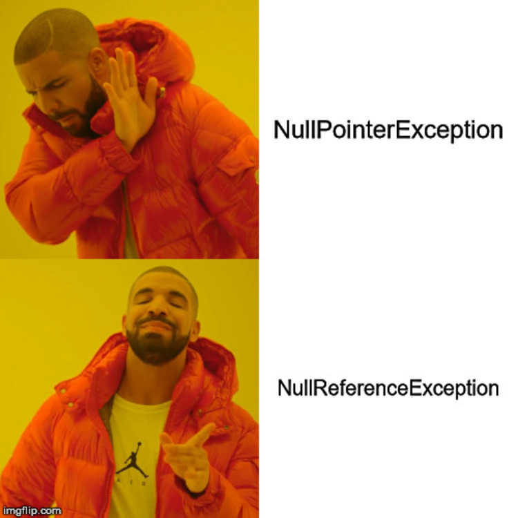
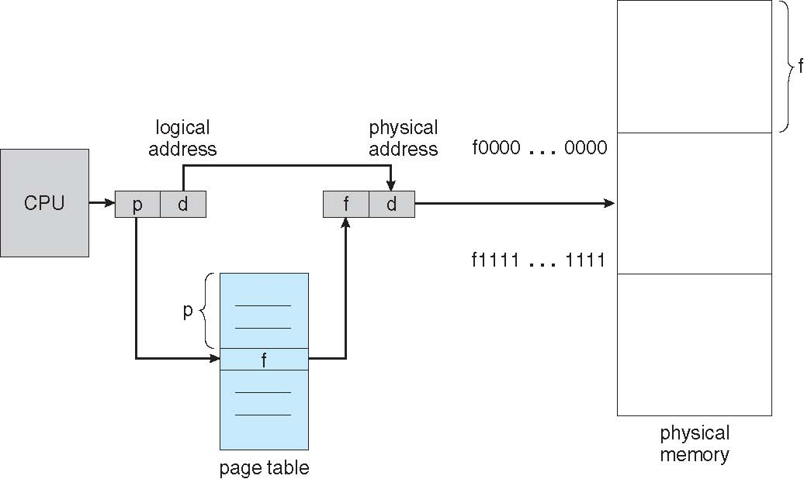
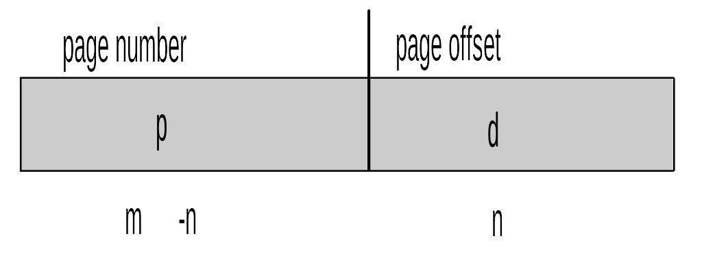
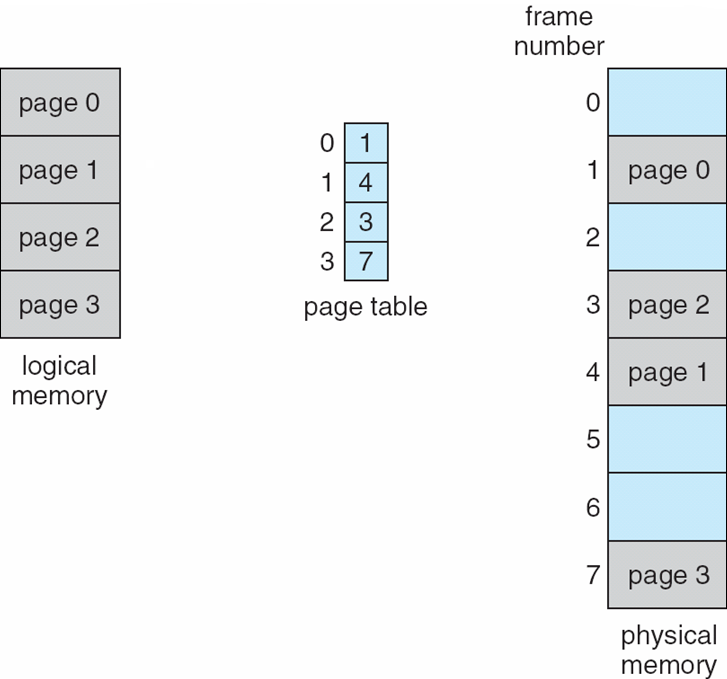
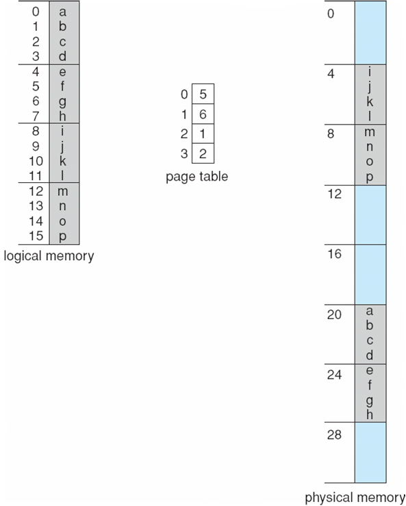
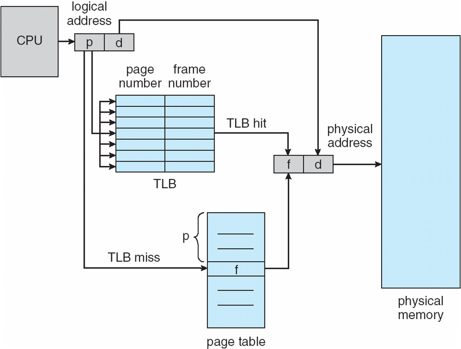
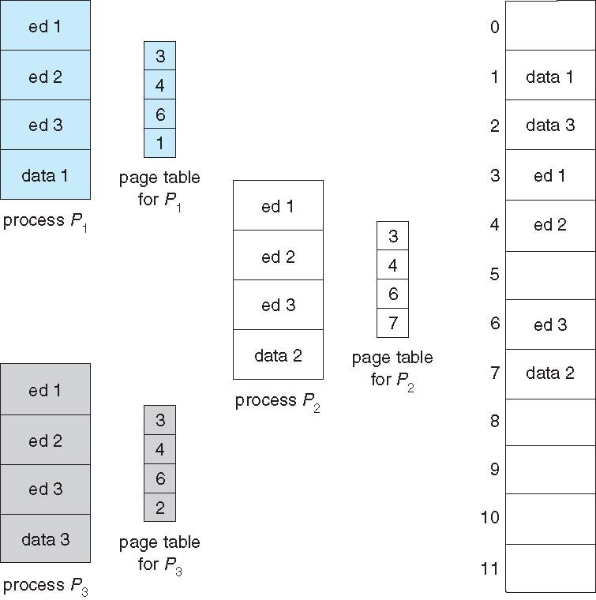

CS3100 - Module 5 - Lecture 30 - Fri Nov 08

# Announcements

## HackUSU

USU's 24-hour hackathon - November 15-16th

Register and find more information at https://hackusu.org

# Topics:
* 8.2 Swapping
* 8.3 Contiguous Memory Allocation
* 8.3.2 Memory Allocation
* 8.3.3 Fragmentation
* 8.4 Segmentation
* 8.5 Paging
* 8.5.4 Shared Pages

----------------------------------------------------------------------------
## Intro video

[What is DOS Protected Mode? | Nostalgia Nerd](https://www.youtube.com/watch?v=XAyQLV5bbb0)

## Memes

# 8.2 Swapping

Last time we discussed the possibility of a running process being copied from
RAM onto the Disk (or s ome other, slower "backing store" that's larger than
RAM) when it has been idle for a long time.

#### Swapping
Moving a process's memory image from RAM onto a backing store, or vice versa.

This gives us the illusion of (nearly) unlimited RAM, but at the cost of speed.
When your computer is going slow, and you hear the HD clicking and see the HDD
access light flickering, this is probably what's going on.

We will now discuss the problems we run into with regards to juggling many
processes' images in memory. Keep these problems in mind because they are
magnified 10,000 fold when swapping is involved because the same problems can
occur there, except they take much longer to play out.

#### Thrashing
Said of a process that is so busy swapping data back and forth to the backing
store that it spends more time in this activity than in doing useful work

# 8.3 Contiguous Memory Allocation

This section deals within the framework of physical memory.

The CPU cannot directly access disk drives; it may only access Registers and
RAM. Therefore, a program must be copied into main memory in order to become a
running process.

An early method of arranging many processes in memory is contiguous memory
allocation.

#### Contiguous Memory Allocation
Put the entire process image into a single extent of memory

*What problems can you envision for the contiguous memory allocation scheme?*

* If the free memory isn't contiguous, you can run out of memory while still
  having enough memory - it's just not in a useful position

# 8.3.2 Memory Allocation

Instead of just dividing up the RAM by entire procesess, we'll divide RAM into
many fixed-size partitions. Think of the level of organization created by
dividing a parking lot into stalls instead of just letting anybody park
wherever they wish (or how nice a parking lot becomes after a snowstorm before
the plows have a chance to clear it off).

#### Partition
Fixed-size region of memory which contains exactly one process

*What problems can you envision for the fixed partition allocation scheme?*

* Your partition size limits how large a process can be
    * If I choose a partition size that's too small, lots of programs won't run
      on my system
    * If I choose a partition size that's too big, I'm wasting lots of space

### Variable Partition Method
OS keeps track of which parts of memory are used and which are available;
processes are given a chunk of memory based upon its needs

* The OS gives out a parking stall that's just the right size for your car (process)
* The chunks of memory must still be contiguous

#### Hole
A block of available memory from which the OS may draw

When a process begins, the OS searches for a hole that is large enough to
accommodate the process. When it finds a hole that is larger than needed, the
OS gives part of it to the process, and the remainder becomes a smaller hole.

*What problems can you envision for the variable partition method?*

#### Dynamic Storage-Allocation Problem
Concerned with how to satisfy a request of size *n* from a list of free memory holes

There are three common strategies to solving this problem:

* First-Fit: Allocate the 1st hole in the list which is large enough for this request
* Best-Fit: Scan the entire list and allocate the smallest hole which is just
  large enough; this leaves the smallest remaining hole
* Worst-Fit: Scan the entire list and allocate the largest hole, leaving behind
  the largest hole

#### Which strategy is best?

Simulations have shown that 1st-fit and best-fit are better than worst-fit in
terms of storage space efficiency and time. 1st-fit is faster than best-fit,
and these are approximately equal for storage space efficiency.
  

# 8.3.3 Fragmentation

With all of these leftover holes, we have to decide what to do about them.
When holes become too small they are very unlikely to be useful at all.

#### External Fragmentation
When the free holes are not contiguous, then we arrive at a situation where
there is enough free memory in the system to satisfy the request, but it is not
usable.

#### Internal Fragmentation
When memory allocated to a process is slightly larger than needed memory; this
size difference is memory internal to a partition, but is still unused memory

#### Compaction
Solve the problem of external fragmentation by shuffling memory contents to
place all free memory together in one large block.

Compaction is possible only if relocation is dynamic, and is done at execution-time.
Absolute Code bound at compile-time and load-time relocatable code cannot have
compaction applied to it.

Now you know why modern, mainstream OSes use execution-time binding.

# 8.4 Segmentation

This section deals within the framework of logical memory. The idea of
segmentation relates to the view of memory that a programming language gives
you as a programmer.

We think in terms of "stack", "heap", globals and text data (code). Each of
these can be thought of as distinct segments of memory, each to their own
purpose.

In other words, a logical address space is a collection of segments. Each
segment has its own size, and the program knows where to find them at run time.

The advantage of this view of things is that it supports a non-contiguous
address space for a program. The disadvantage is that the segments may have
arbitrary sizes, leading to external fragmentation :(

Now, recall that all of these problems that happen in RAM can *also* happen to
our swap space, except there it's 10,000X worse!

# 8.5 Paging

Finally, we've arrived at the method used by modern OSes, which combines the
advantages of fixed-size partitions with a way to minimize the amount of
thrashing and fragmentation that occurs on the backing store.

#### Frames
Fixed-size blocks of physical memory

#### Pages
Fixed-size blocks of logical memory

Paging works by partitioning memory (and the backing store) into fixed-size
blocks and allocating these to processes as needed. This avoids external
fragmentation because there are no blocks of memory which are too small to be
useful.

The CPU keeps track of the mapping of pages to frames with a page table. 

#### Page Table
A table mapping pages to memory frames.  Given a page number, the page table
returns the physical address at which this page begins

### Address Translation Scheme
With the addition of a page table, the addresses used by the CPU will now look
a little bit different. An address generated by CPU is a 2-tuple: (p, d)

* Page number (p)
    used as an index into a page table which contains base address of each page
    in physical memory

* Page offset (d)
    combined with base address to define the physical memory address that is
    sent to the memory unit

With paging, internal fragmentation is a risk: if a process only needs to
allocate 1 byte it may be given a 4k block. However, this is the most memory a
process can possibly waste.

Many modern hardware platforms support paging by providing hardware which
manages a page table.

The Page table itself is kept in main memory

#### The page-table base register (PTBR) points to the page table

#### The page-table length register (PTLR) indicates size of the page table

In this scheme every data/instruction access requires two memory accesses

* One for the page table 
* One for the data / instruction

Thus, memory access is slowed by a factor of `2` :(

The two memory access problem can be solved by the use of a special fast-lookup
hardware cache called associative memory or translation look-aside buffers
(TLBs)

#### Translation Look-aside Buffer

High-speed, associative memory cache

The TLB is given a page number. It is able to look for that page number in all
of its entries *simultaneously*. In order for it to be that fast, it must be
quite small.

# 8.5.4 Shared Pages

Paging combined with Execution-Time binding offers an attractive possibility;
with memory nicely partitioned into small chunks, we can avoid the possibility
of filling our frames with duplicated data from common processes by *sharing*
those identical pages among many processes.

*What problems can you envision for the shared page allocation scheme?*

These pages must be read-only. The code they host must be reentrant (or pure code)

#### Reentrant (Pure) Code
Non self-modifying code

