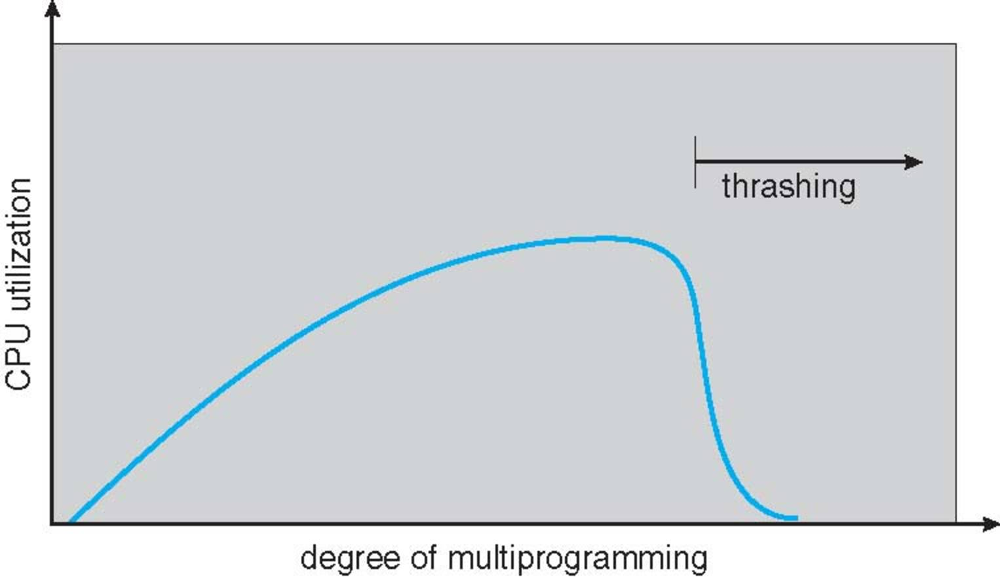

CS3100 - Module 5 - Lecture 33 - Mon Nov 18

# Announcements

## FSLC Open Source Game Night

* Come relax and de-stress before finals week sucks the fun out of life
* Play Open Source games against each other
* Pizza will be provided

+ Wednesday, 11/20
+ 6pm @ ESLC room 053

FSLC now has a [Discord!](https://discord.gg/RHppcek), and you're invited!

# Topics:
* 9.4.3 Optimal Page Replacement
* 9.4.4 Least Recently Used PR Scheme
* 9.6 Thrashing

----------------------------------------------------------------------------
# 9.4.3 Optimal Page Replacement

Previously, we explored the simple, FIFO page replacement scheme, and observed
how it may suffer from Belady's anomaly, that is, the FIFO page replacement
scheme may perform worse when increasing the number of frames in a system.

The best possible page replacement scheme would know which page will not be
needed for the greatest length of time and replace it.

#### Optimal Page Replacement (OPT)
Replace the page that will not be used for the longest period of time

Of course, this algorithm suffers from a serious flaw: without a time-machine
we won't be able to know which pages have the property of not being needed for
the longest period of time. But don't let that stop you from using OPT as a
convenient standard to measure against; we can always compare our
*implementable* PR scheme against OPT as a measurement of how well it performs.

# 9.4.4 Least Recently Used PR Scheme

By using the recent past as an approximation for the imminent future we arrive at the LRU algorithm.

#### Least Recently Used Algorithm (LRU)
Replace page that has not been used in the most amount of time

How might we implement this algorithm?
* Use a clock or a counter to help us track when we last *used* a page (reads
  or writes), augmenting the page table to have a field to contain this info.
  This means that even reading memory requires us to write to the page table.

  We must also scan the page table looking for the oldest page whenever we need
  to replace a page.
  
* Use a doubly-linked list-based stack; each time we change a page, move it to
  the top of the stack.

  Finding the oldest page is fast as it's at the bottom of the stack. If we
  keep a pointer pointing to the bottom of the stack, we don't even have to
  traverse the list

It has been proven that the LRU algorithm cannot suffer from Belady's anomaly.
All at the low, low cost of always modifying the page table for each and every
access!

LRU is nice on paper, but very few systems actually use it. 

# 9.6 Thrashing

If a process does not have "enough" pages, the page-fault rate is very high

* Page fault to get page
* Replace existing frame
* But quickly need replaced frame back
* This leads to:
    + Low CPU utilization
    + Operating system thinking that it needs to increase the degree of multiprogramming
    + Another process is added to the system, making the paging situation even worse

#### Thrashing: when a process spends more time swapping pages in and out than it spends doing useful work

