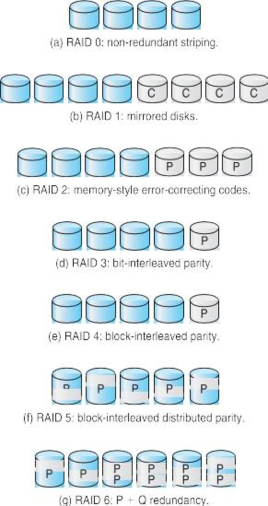

CS3100 - Module 6 - Lecture 37 - Mon Dec 02

# Announcements

## Returning Your Raspberry Pi

Return your complete Raspberry Pi kit (case, RPi computer, MicroSD card, in the
original box) by Friday, Dec 6th.  You can bring it to class or to my office.
Your grade will not go through until I have marked you off my list.  Please
contact me ASAP if there will be any issues with the return.

You will be able to buy the kits from [USU Surplus](https://www.usu.edu/surplus/)
for $40 next week.  This sale is not limited to CS3100 students, and you can
buy more than one kit.

# Call on 2 designated questioners

# Topics:
* 10.5.1: Disk formatting 
* 10.5.2: Boot block
* 10.5.3: Bad Blocks
* 10.6 Swap Space
* 10.7 RAID
* 10.7.1 Improve Reliability via Redundancy
* 10.7.2 Improve Performance via Parallelism
* 10.7.3 RAID Levels

----------------------------------------------------------------------------
# 10.5.1: Disk formatting 

#### Low-level formatting
Dividing a disk into sectors that the disk controller can read and write
(a.k.a. physical formatting)

Each sector can hold
* header information
* data
* error correction code (ECC)

A sector is usually 512 bytes of data, along with the overhead of the header and ECC

#### Logical formatting
Writing file management information and data structures to the disk in support of a file system

To use a disk to hold files, the operating system still needs to record its own
data structures on the disk. This is called "formatting" or "making a file
system"

The OS may also partition the disk into one or more groups of cylinders.
Each partition is treated by the OS as a logical disk

#### Raw Disk I/O
Accessing the data on the disk directly as an array of bytes

The OS may also allow applications to access the disk via raw I/O for
performance reasons; there is less overhead in time and space with raw access
than by going through the OS'es filesystem logic.

# 10.5.2: Boot block

## Problem:

The BIOS which bootstraps the OS needs to read the OS kernel which is
located in a file on a filesystem on the disk. If the OS hasn't been loaded,
how will the BIOS be able to understand the filesystem format of the data?

## Solution:

Just leave the 1st part of the disk unformatted, and put a simple bootstrap
program there which the BIOS can load and execute without needing an OS

This portion of the disk is called the *boot block*, and is located on a disk
designated to be the *boot disk*

#### Master Boot Record (MBR)

The first sector of the boot disk on IBM PC systems

# 10.5.3: Bad Blocks

Hard drives degrade and wear out over time. Hopefully, the head doesn't come
into contact with the surface of the disk and "crash".

When that happens, the disk controller can detect that something is wrong
because the ECC won't add up for those sectors.

* If the error is small, the ECC can be used to recover the missing data.

* If the error is big, then that's too bad :(

The disk (or the OS) can remember which sectors are bad and avoid using them in
the future. The disk may also reserve some spare sectors which are hidden from
the OS. It can logically replace the bad sector with a good one elsewhere on
the disk.

For example, suppose sector #34 has gone bad. The OS will continue to request
data from sector #34, but the disk will surreptitiously use sector #3254124791
instead. This replacement will occur even when raw disk access is used: it is
completely handled by the disk controller, and thus beyond the control of the
OS.

This is like the difference between physical RAM addresses vs. logical RAM
addresses.

# 10.6 Swap Space

Recall that virtual memory uses disk space as an extension of main memory.
The area on disk where the Virtual Memory pages reside when physical memory is
exhausted is similarly divided into page-sized chunks.

This swap area can be a dedicated partition accessed with raw I/O:

Pro:
* Faster access (it's already too slow when compared to RAM, let's not make it
  slower with the overhead of the file system)

Con:
* Once you create the partition, it's a big pain to resize it later

The swap area may instead be stored in a *swap file* residing on the file
system with all of the other files. As it depends upon ordinary file system I/O,
it's pros/cons are the opposite of the swap partition.

# 10.7 RAID Redundant Array of (Inexpensive|Independent) Disks

As storage costs have plummeted it has become feasible to throw money at the
problem of reliable and efficient storage. By combining many disks into one
logical storage system we avoid putting all of our data into one basket, so to
speak.

We are also able to parallelize disk I/O, improving throughput of the system.

# 10.7.1 Improve Reliability via Redundancy

#### Mirroring
Duplicating all data on entire disks

The most obvious approach is to use two disks instead of one. Each disk is a
perfect copy of the other, until that fateful day when the backup image is
required.

Mirroring halves the amount of space available (we're using two disks to do the
job of one, after all) and neither hurts nor improves performance: the data
still exists serially on each disk, thus reads/writes to/from the disk are
limited by the throughput of an individual disk.

# 10.7.2 Improve Performance via Parallelism

#### Data striping
Spreading blocks of data across multiple disks

Instead of treating each block of data as an indivisible unit, we can slice the
block into stripes, storing a fraction of the block on many disks at once. Now
reads/writes can occur in parallel across N disks, meaning that each read/write
operation takes only 1/N as long.

Striping alone does not improve reliability. In fact, striping *increases* our
chances of data loss, because instead of depending upon the odds of 1 disk
failing, we're dependant upon the odds of 1:N disks failing. As we incorporate
more disks we into this system we increase the chance of experiencing a failure
in any one of them.

# 10.7.3 RAID Levels

The correct answer is to combine the concepts of mirroring with striping, with
a little pinch of ECC thrown in.

At the low, low cost of extra disks, we can stripe our data along with ECC
across many disks. We again reap the benefits of parallelism, and a failure in
any one disk won't be enough to stop us. Provided that single failed disk can
be replaced before *yet another* disk fails.

There are many ways to combine mirroring, striping and error correction. The
common configurations are called RAID levels.

* RAID level 0: Striping for performance only

* RAID level 1: Disk mirroring.
    No performance gain and 50% reduction in storage capacity

* RAID level 2: Memory-style ECC.
    Data from one lost disk can be recovered from the remaining disks in the system.
    Requires fewer disks than simple mirroring
    Striping improves performance

* RAID levels 3&4: (Bit|Block)-interleaved parity
    Like level 2 but requires only 1 extra disk per 4 data disks
    The extra disk in the set contains only parity ECC data

* RAID level 5: Block-interleaved distributed parity
    Like level 4 but parity data is spread across all disks in the array

* RAID level 6: P + Q redundancy scheme
    Like level 5 in that redundancy data is spread across disks, but more of it is kept.
    This means that RAID level 6 arrays are resilient against multiple disk failures.
    Consequently, extra storage is needed for this extra redundancy data.

