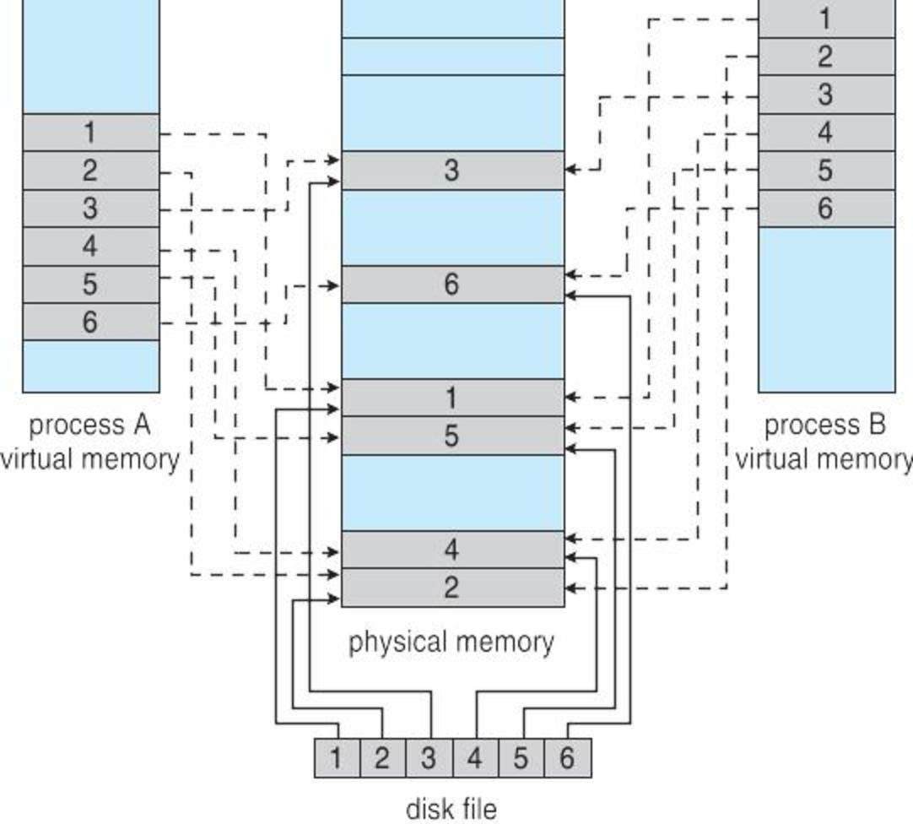
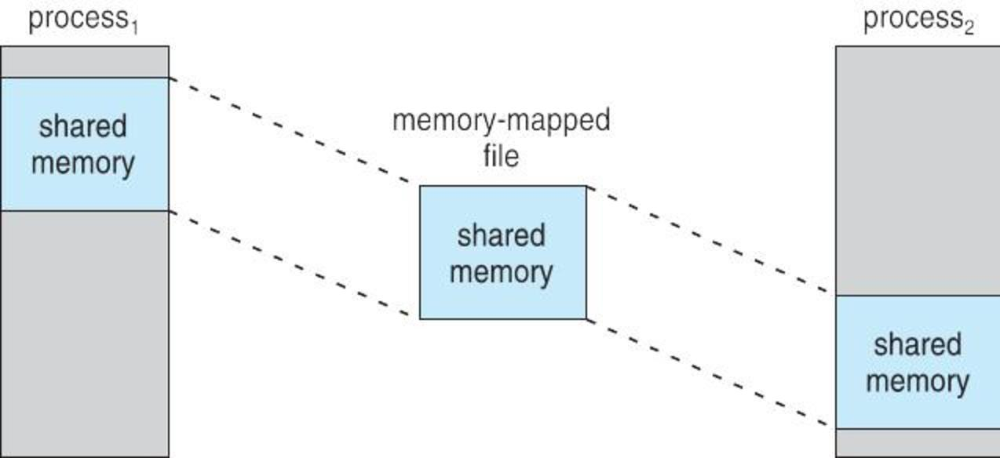

CS3100 - Module 6 - Lecture 35 - Fri Nov 22

# Announcements

# Call on 2 designated questioners

# Topics:
* 9.7 Memory-Mapped Files
* Interacting with Linux's Virtual Memory system

----------------------------------------------------------------------------
# 9.7 Memory-Mapped Files

We've studied pure demand paging in which an OS relies entirely on its demand
paging system for all disk-to-memory operations.

Our applications can take advantage of this through an OS API known in Unix as
`mmap()`. The result is that we use an array which is transparently connected to
a file on-disk. Searching for the right byte in the file becomes equivalent to
scanning an array with a for-loop. Array update operations now behave like
`read()`/`write()` system calls.

#### Memory-Mapped Files: treat file I/O as routine memory access

The `mmap()` system call works by associating a disk block with a page of
memory (another reason to favor page-sizes which are multiples of disk blocks).

The file is originally read into memory via demand paging.

But when does written data make it to disk? It happens periodically and / or at
file `close()` time; the user doesn't have to manually see to it ;)

We can even combine the concepts of mmap with shared-memory to share a common
file between processes at the speed of RAM

### Demo: [mmap/](mmap/)

# Interacting with Linux's Virtual Memory system

Your OS is able to take advantage of many optimizations as a result of
demand-paging. The most obvious ones involve caching ordinary disk I/O
operations in unused portions of RAM.

You are now able to understand some more of what htop's pretty color-coded
memory bar has been telling you about your memory use all along.

Enter htop's help screen with the F1 key. It describes the memory bar like this:

    Memory bar:    [used/buffers/cache                            used/total]

* used (green)
  These are frames filled with the pages of running processes: the kind of
  memory we've mostly been discussing these past two chapters

* buffers (blue)
  These frames contain filesystem metadata: information about files on disk
  which are not part of the file's contents. Paths, ownership information,
  permissions, timestamps, etc.

* cache (yellow)
  These frames hold blocks of hard disk data.  Every time you read a file it's
  copied from the disk into RAM anyhow. The OS may as well hold onto it on the
  chance that you need it again.

  This filesystem cache acts like an automatic mmap().
  

Armed with this knowledge, we can observe the effects of our commands on the
system and infer what the OS is doing in response.

## Fun Linux Kernel Tricks

*Note:* In the examples below, commands beginning with a `$` prompt are
intended to be run as an ordinary user.  Commands prefixed with a `#` prompt
denote commands which must be run as the root user.

The Linux Kernel makes it possible for us to poke around with some aspects of
its Virtual Memory system through special files in the /proc directory.

## System memory information /proc/meminfo

This file reports statistics about memory usage on the system

    $ cat /proc/meminfo

## Observing memory fragmentation with /proc/buddyinfo

Recall that we discussed fragmentation back in Chapter 8. The Linux kernel
exposes some of its controls to us through virtual files in the /proc
directory.

By reading from and writing to these files, we can learn a little bit about how
the Linux virtual memory system works.

## From the manpage `proc(5)`:

> This file contains information which is used for diagnosing memory
> fragmentation issues.  Each line starts with the identification of the node and
> the name of the zone which together identify a memory region This is then
> followed by the count of available chunks of a certain order in which these
> zones are split.

    $ watch -d -n.1 cat /proc/buddyinfo

## Compacting memory with `/proc/sys/vm/compact_memory`

> When 1 is written to this file, all zones are compacted such that free memory
> is available in contiguous blocks where possible. The effect of this action
> can be seen by examining /proc/buddyinfo.

## Dropping caches with `/proc/sys/vm/drop_caches`

> Writing to this file causes the kernel to drop clean caches, dentries, and
> inodes from memory, causing that memory to become free. This can be useful for
> memory management testing and performing reproducible filesystem benchmarks.
> Because writing to this file causes the benefits of caching to be lost, it can
> degrade overall system performance.

You choose how many caches to drop by writing values 1, 2, or 3 to this file, 3
being the value that drops the most caches.

> Because writing to this file is a nondestructive operation and dirty objects
> are not freeable, the user should run sync(1) first.

    # echo 3 > /proc/sys/vm/drop_caches

Well, since you mention it...

    # time find /usr/bin -type f -exec cat '{}' > /dev/null \;
    # time find /usr/bin -type f -exec cat '{}' > /dev/null \;   # notice how fast this is the 2nd time!
    # time find /usr/share -type f -exec cat '{}' > /dev/null \; # this really fills up your RAM
    $ watch -d -n.1 cat /proc/buddyinfo
    $ htop
    # sync; echo 3 > /proc/sys/vm/drop_caches
    # echo 1 > /proc/sys/vm/compact_memory

## Controlling the system's "swappiness" with `/proc/sys/vm/swappiness`

The value in this file controls how aggressively the kernel will swap memory
pages. Higher values increase aggressiveness, lower values decrease
aggressiveness.  The default value is 60.

    $ cat /proc/sys/vm/swappiness

